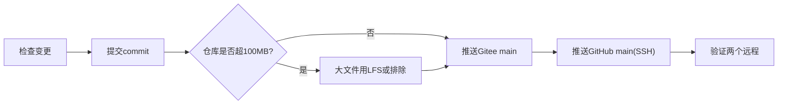

# 仓库一键同步推送工作流-Zcode版

## 一、目标

将本地仓库变更同步推送到 GitHub 和 Gitee 两个远程仓库，统一推送到 main 分支，使用北京时间。

## 二、适用范围

- 教科研数据仓库：`/Users/wangzirui/教科研数据仓库`
- Zcode 工作流汇总：`/Users/wangzirui/Zcode工作流汇总`
- 其他需要双远程同步的 Obsidian 仓库

## 三、远程配置

### 3.1 GitHub（SSH 方式）

> [!warning] GitHub 必须用 SSH
> HTTPS 方式会 408 超时，必须用 SSH。

| 项 | 值 |
|---|---|
| remote 名称 | `github-ssh` |
| SSH 地址 | `git@github.com:169068671/<仓库名>.git` |
| SSH key | `~/.ssh/id_ed25519` |
| 推送命令 | `git push github-ssh main --force` |

**首次配置**（新仓库需要添加 remote）：

```bash
git remote add github-ssh git@github.com:169068671/<仓库名>.git
```

### 3.2 Gitee（SSH 方式）

| 项 | 值 |
|---|---|
| remote 名称 | `gitee` |
| SSH 地址 | `git@gitee.com:dongtaishiruimoyanjingdian/<仓库名>.git` |
| 推送命令 | `git push gitee main` |

### 3.3 各仓库远程地址

| 仓库 | GitHub | Gitee |
|---|---|---|
| 教科研数据仓库 | `git@github.com:169068671/Teaching-and-Research-Data-Warehouse.git` | `git@gitee.com:dongtaishiruimoyanjingdian/Teaching-Research-Data-Warehouse.git` |
| Zcode 工作流汇总 | `git@github.com:169068671/Summary-of-zcode-Workflows.git` | `git@gitee.com:dongtaishiruimoyanjingdian/Zcode-Workflow-Summary.git` |

## 四、大文件处理策略

### 4.1 GitHub

- 直接作为普通 git 对象推送，无容量限制。
- 单次推送 <100MB 更稳定；如超时，分批推送或用 SSH。
- 不需要 LFS。

### 4.2 Gitee

- 免费版仓库：100MB 总量限制，不支持 LFS。
- 企业版仓库：支持 LFS，容量更大。
- 如仓库超 100MB：
  - 方案 A：大文件用 LFS（需企业版仓库）。
  - 方案 B：大文件加入 `.gitignore` 排除，Gitee 只放小文件版。
  - 方案 C：Gitee 推送到单独的 slim 分支，排除大文件。

### 4.3 `.gitignore` 模板

```
# 系统文件
.DS_Store
__MACOSX/
.zcode/

# 临时文件
tmp/
output/

# 超大文件（按需排除，Gitee免费版）
# 60_原始资料/文献原文/FreeCAD课题资料_按开题论证书设计_中期汇报_MD和PDF版本.zip
```

## 五、完整执行流程



### 阶段 1：检查与提交

```bash
# 进入仓库目录
cd /Users/wangzirui/<仓库名>

# 检查变更
git status --short

# 添加所有变更
git add -A

# 提交（使用北京时间，commit信息用英文或中文均可）
git commit -m "描述本次变更内容"
```

### 阶段 2：推送到 Gitee

```bash
# 推送到 Gitee（国内速度快）
git push gitee main --force
```

> [!note] 如果 Gitee 超限
> 如果报错 `exceeds quota 100MB`：
> 1. 检查是否有大文件未排除：`find . -not -path './.git/*' -type f -size +5M`
> 2. 将大文件加入 `.gitignore` 或用 LFS
> 3. 从 git 移除：`git rm --cached <大文件>`
> 4. 重新提交并推送

### 阶段 3：推送到 GitHub

```bash
# 推送到 GitHub（必须用 SSH）
git push github-ssh main --force
```

> [!warning] 如果 GitHub 超时
> 如果报错 `HTTP 408`：
> 1. 确认用的是 SSH remote（`github-ssh`），不是 HTTPS（`origin`）
> 2. SSH 仍超时时，增大缓冲区：
>    ```bash
>    git config http.postBuffer 524288000
>    ```
> 3. 分批推送：先推小 commit，再推大 commit

### 阶段 4：验证

```bash
# 验证 Gitee
git ls-remote gitee main

# 验证 GitHub
git ls-remote github-ssh main

# 两个远程的 commit hash 应与本地一致
git log --oneline -1
```

## 六、一键推送脚本

将以下脚本保存为 `/Users/wangzirui/<仓库名>/sync.sh`：

```bash
#!/bin/bash
# 仓库一键同步推送脚本
# 用法: ./sync.sh "commit信息"

REPO_DIR="$(cd "$(dirname "$0")" && pwd)"
cd "$REPO_DIR"

COMMIT_MSG="${1:-Auto sync $(date '+%Y-%m-%d %H:%M:%S CST')}"

echo "========== 仓库同步推送 =========="
echo "仓库: $REPO_DIR"
echo "时间: $(date '+%Y-%m-%d %H:%M:%S CST')"
echo "提交信息: $COMMIT_MSG"
echo ""

# 检查变更
CHANGES=$(git status --short | wc -l | tr -d ' ')
if [ "$CHANGES" -eq 0 ]; then
    echo "无变更，直接推送"
else
    echo "变更: $CHANGES 条"
    git add -A
    git commit -m "$COMMIT_MSG"
fi

# 推送 Gitee
echo ""
echo "=== 推送 Gitee ==="
git push gitee main --force 2>&1
GITEE_STATUS=$?

# 推送 GitHub (SSH)
echo ""
echo "=== 推送 GitHub (SSH) ==="
git push github-ssh main --force 2>&1
GITHUB_STATUS=$?

# 验证
echo ""
echo "=== 验证 ==="
echo "本地:   $(git log --oneline -1)"
echo "Gitee:  $(git ls-remote gitee main 2>&1 | head -1 | cut -c1-7)"
echo "GitHub: $(git ls-remote github-ssh main 2>&1 | head -1 | cut -c1-7)"

if [ $GITEE_STATUS -eq 0 ] && [ $GITHUB_STATUS -eq 0 ]; then
    echo ""
    echo "✅ 两个仓库推送成功"
else
    echo ""
    echo "⚠️  部分推送失败: Gitee=$GITEE_STATUS GitHub=$GITHUB_STATUS"
fi
```

使用方法：

```bash
# 给脚本执行权限（首次）
chmod +x /Users/wangzirui/<仓库名>/sync.sh

# 一键推送（自动生成commit信息）
./sync.sh

# 指定commit信息
./sync.sh "添加新分解报告"
```

## 七、推荐调用语句

### 一键推送（两个仓库）

> 按"仓库一键同步推送工作流"处理，提交所有变更并推送到 GitHub 和 Gitee 的 main 分支。GitHub 用 SSH（github-ssh remote），Gitee 用 SSH（gitee remote）。

### 只推送 GitHub

> 只推送到 GitHub（SSH），不推 Gitee。

### 只推送 Gitee

> 只推送到 Gitee，不推 GitHub。

### 推送时排除大文件

> 推送前检查大文件（>5MB），将超限文件加入 .gitignore 后再推 Gitee；GitHub 不排除。

## 八、常见问题

| 问题 | 原因 | 解决 |
|---|---|---|
| GitHub HTTP 408 | HTTPS 超时 | 改用 SSH remote（`github-ssh`） |
| Gitee `exceeds quota 100MB` | 仓库超 100MB | 大文件用 LFS 或排除 |
| Gitee `LFS only supported in paid enterprise` | 免费版不支持 LFS | 迁移到企业版仓库或排除大文件 |
| `Permission denied (publickey)` | SSH key 未添加 | 把 `cat ~/.ssh/id_ed25519.pub` 添加到 GitHub/Gitee 账户 |
| `non-fast-forward` | 远程有本地没有的 commit | 先 `git pull <remote> main` 再推送，或 `--force` 强推 |

## 九、关联

- 用户长期偏好：[[../01_长期记忆/用户长期偏好]]（Git 推送部分）
- GitHub 仓库一键同步工作流（旧版）：[[GitHub仓库一键同步工作流]]
