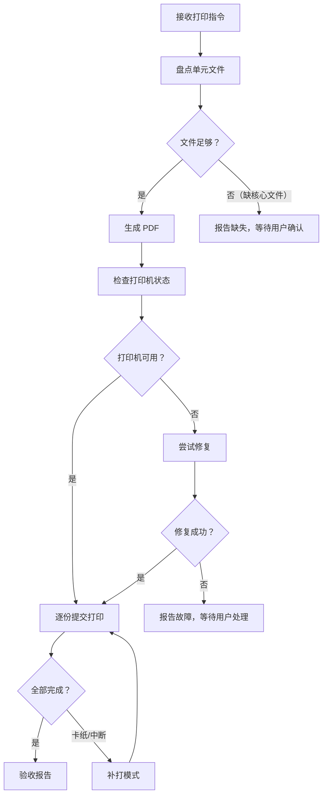

# 学习资料打印工作流-Zcode版

> [!important] 工作流目标
> 把一个单元的学习资料（按 00–09 数字命名体系）自动分类为孩子用和家长用，生成 PDF 并提交到奔图 Pantum M6500NW 打印机打印。支持卡纸后从指定页补打。

## 一句话调用

> 按"学习资料打印工作流"打印化学第二单元资料，大睿小墨各一份学习资料，家长一份答案和说明。

## 适用范围

### 适合

- 单元资料已按 [[孩子单元学习复讲评估工作流]] 的 00–09 数字命名体系建好。
- 需要快速把一个单元的 Markdown 资料打印成纸质件给孩子和家长。
- 卡纸后需要从中间某页补打。

### 不宜

- 多学科批量成册（用孩子们的知识点库中的「每科资料汇总成册工作流」）。
- 单元资料尚未按数字命名体系整理（先按 [[孩子单元学习复讲评估工作流]] 建好再打印）。
- 打印机 IPv6 地址漂移导致完全失联（先手动执行 `printer_repair_uri` 修复）。

## 工具和环境

| 工具 | 用途 | 验证命令 |
|---|---|---|
| `pandoc` 3.x | Markdown → PDF | `pandoc --version` |
| `xelatex`（TeX Live） | PDF 排版引擎 | `which xelatex` |
| `pypdf` | PDF 合并、页码提取、补打 | `python3 -c "import pypdf"` |
| `pantum-printer` MCP | 打印机状态、队列、打印提交 | `printer_status` |
| `lp`（CUPS） | 提交打印任务 | `which lp` |

> [!info] 字体
> PDF 使用 `PingFang SC` 字体（macOS 自带），确保中文和标点正常渲染。
> **PingFang SC 缺少 Unicode 上标/下标字形**（⁺ ⁻ ² ³ ₀ ₁ ₂ ₃ ₄ 等），化学符号如 Na⁺、SO₄²⁻ 会丢字。`clean_markdown` 已内置转换：连续上标 → `$^{...}$`，连续下标 → `$_{...}$`，xelatex 渲染为正常上下标。

> [!warning] 打印机连接特性
> 奔图 M6500NW **IPv4 不通，仅 IPv6 link-local 可用**。CUPS 队列名 `Pantum_M6500NW_Series_7897EA`。地址漂移时用 `printer_repair_uri` 修复。

## 文件分类规则

脚本 `print_unit_materials.py` 按文件名前缀自动分类：

| 分类 | 文件名前缀 | 说明 |
|---|---|---|
| 孩子用 | `01_` `02_` `03_` `04_` `05_` `06_` `07_` `09_` | 讲义、练习卷、复讲卡、闭卷卷 |
| 孩子专用 | `08大睿_` `08小墨_` | 分人提纲，各入各份 |
| 家长用 | `00_` `00附_` `0X答案_` `08_` `09答案_` `说明_` | 行动指南、答案、错点总表、说明 |
| 跳过 | `【按数字顺序使用】` | 顺序表不给任何人打印 |

> [!important] 分份逻辑（用户 2026-08-09 确认）
> - **家长份** = `00_` 行动指南 + 所有答案卷（`02答案_` `04答案_` `06答案_` `09答案_`）。家长不讲课，只组织、批改、守关。
> - **大睿份 / 小墨份** = `01_` 讲义 + `02_`/`04_`/`06_` 练习卷 + `03_`/`05_`/`07_` 复讲卡，按数字顺序排列。两人内容相同，用封面页标注姓名区分。
> - `08_` 错点汇总卡归家长；`08大睿_`/`08小墨_` 各入各份（打印时按需加入）。
> - 用户可临时指定排除某些编号（如"08 以后的不打"），脚本默认全打，排除靠人工确认。

> [!note] 缺失文件
> 部分单元可能缺少 00/07/08/09 等文件（如第二单元只有 01–06）。脚本只打印已有文件，缺失文件不阻断流程，但会在盘点阶段列出。

## 总流程



## 阶段 1：确认范围与盘点文件

### 操作

1. 确认学科、单元目录名、学生列表（默认大睿 + 小墨）。
2. 脚本自动扫描单元目录下的 `.md` 文件。
3. 按文件名前缀分类为孩子用 / 家长用 / 跳过。
4. 列出分类结果和缺失文件。

### 命令

```bash
# 只盘点不打印，确认文件分类
python3 99_System/print_unit_materials.py \
  --subject 化学 \
  --unit "第二单元-我们周围的空气" \
  --no-print
```

### 阶段门 G1

- [ ] 学科和单元目录确认无误。
- [ ] 孩子用文件至少包含 01 讲义。
- [ ] 家长用文件至少包含一份答案或说明。
- [ ] 缺失文件已列出但不阻断。

## 阶段 2：生成 PDF

### 操作

1. 为每个学生合并孩子用 Markdown + 个人专属文件。
2. 为家长合并家长用 Markdown。
3. 每份加大字封面页（LaTeX titlepage：人名居中 Huge 字号 + 学科单元名 + 日期），一眼区分归属。
4. Markdown 清洗：去 YAML frontmatter、解析 Obsidian 双链、转 callout、**转上标/下标为 LaTeX 命令**。
5. pandoc + xelatex 转 PDF（A4、2.5cm 边距、11pt、PingFang SC 字体）。
6. 用 `pdftoppm` 渲染含化学符号的页面，视觉确认上标/下标无丢字。

### 输出位置

```text
output/pdf/打印-{学科}-{单元名}-{YYYY-MM-DD}/
├── 大睿_{学科}_{单元名}.pdf
├── 小墨_{学科}_{单元名}.pdf
└── 家长_{学科}_{单元名}.pdf
```

### 阶段门 G2

- [ ] 每份 PDF 页数大于 0。
- [ ] 中文无缺字、无黑方块。
- [ ] 化学符号上标/下标（Na⁺、SO₄²⁻ 等）渲染正常，无丢字。
- [ ] 标题页归属信息正确（学生名 / 家长）。
- [ ] **试卷留空检测**（2026-08-20 起，强制执行）：02/04/06/09 文件中每道需书面作答的题后必须有答题线（`____` 整行或 `（　　）` 判分括号）；判断/改错题须有判分括号或答题线；简答题须有 1—4 行 `____` 答题线。连续两题紧挨无答题线即不通过，须补空后再生成 PDF。
- [ ] **禁口述检测**（2026-08-20 起，强制执行）：09 闭卷卷须纯笔试 100 分，不含口述题。出现「口述」「口试」「综合口述」即不通过，须删除后再生成 PDF。口述在 08 提纲复述环节进行，不进 09 试卷。
- [ ] **08 分人检测**（2026-08-20 起，强制执行）：08 错点汇总卡必须拆分为 `08大睿_` 和 `08小墨_` 两个独立文件；共享 `08_` 改为索引。缺分人卡即不通过。
- [ ] **09 分人检测**（2026-08-20 起，强制执行）：09 闭卷卷必须拆分为 `09大睿_` 和 `09小墨_` 两个独立文件，各配分人答案；共享 `09_` / `09答案_` 改为索引。分人卷须含 ★ 针对个人错点的题目。缺分人卷即不通过。
- [ ] **禁 LaTeX 数学公式检测**（2026-08-20 起，强制执行）：所有源文件（01–09）中禁止出现 `$$...$$` 显示数学、`$...$` 行内数学、`\rightarrow` `\frac` `\Delta` 等 LaTeX 命令、`_2` `^2` 等 LaTeX 上下标。化学方程式用 Unicode 写（CO₂ + H₂O → H₂CO₃），离子用 Unicode 写（Na⁺ Cl⁻ SO₄²⁻）。脚本自动转换残留 LaTeX 但源文件应先修好。
- [ ] **桌面归档检测**（2026-08-20 起，强制执行）：试卷照片归档到 `99_归档/2026/练习卷原件/学科UnitN-单元名/学生/`；复述录音归档到 `99_归档/2026/录音原件/学科UnitN-单元名/学生/`。批改或转写完成后立即归档，不依赖用户提醒。桌面不允许残留已批改的试卷照片（`大*.jpg` / `小*.jpg`）或已转写的录音（`*.m4a` / `*.mp3` / `*.wav`）。任务结束前检查桌面。

## 阶段 3：打印前检查

### 操作

1. 调用 `printer_status` 确认 `usable=YES`。
2. 若不可用：
   - 先尝试 `printer_enable`（cupsenable + cupsaccept）。
   - 若仍不可用，尝试 `printer_repair_uri`（重探 IPv6 地址）。
   - 若仍不可用，报告用户手动处理。

### 阶段门 G3

- [ ] 打印机状态 `usable=YES`。
- [ ] 队列无积压任务（或已确认不影响）。

## 阶段 4：提交打印

### 操作

1. 逐份提交 `lp` 命令（或 `printer_print` MCP 工具）。
2. 每份间隔 5 秒，避免队列冲突。
3. 记录每份的 job_id。
4. 等待当前份完成再提交下一份。

### 命令

```bash
# 自动生成 PDF 并打印
python3 99_System/print_unit_materials.py \
  --subject 化学 \
  --unit "第二单元-我们周围的空气"
```

### 阶段门 G4

- [ ] 每份打印任务的 job_id 已记录。
- [ ] 无提交失败。

## 阶段 5：监控与补打

### 卡纸处理

1. `printer_cancel_all` 清空队列。
2. `printer_enable` 恢复打印机。
3. 向用户确认已打完的页数。
4. 用 pypdf 提取剩余页：

```bash
# 从第 8 页开始补打
python3 99_System/print_unit_materials.py \
  --reprint-pdf "output/pdf/.../小墨_化学_第二单元-我们周围的空气.pdf" \
  --reprint-from 8
```

5. 提交补打任务。

### 网络断开处理

1. `printer_repair_uri` 重新探测 IPv6 地址。
2. `printer_status` 确认恢复。
3. 重新提交未完成的任务。

### 阶段门 G5

- [ ] 所有任务已出队（`printer_queue` 返回空）。
- [ ] 卡纸的份已补打完整。

## 阶段 6：验收

### 验收清单

- [ ] 三份 PDF（大睿 / 小墨 / 家长）全部打印完成。
- [ ] 每份页数与 PDF 页数一致。
- [ ] 打印队列已空。
- [ ] 输出目录中 PDF 文件保留备份。

## 常见故障与处理

| 问题 | 原因 | 处理 |
|---|---|---|
| pandoc 报字体错误 | PingFang SC 未安装 | 换 `STSong` 或安装字体 |
| 化学符号 ⁺⁻²³ 丢字 | PingFang SC 缺 Unicode 上标/下标字形 | `clean_markdown` 已自动转 `$^{...}$`/`$_{...}$`；如仍丢字检查正则覆盖 |
| xelatex 超时 | 文件过大或系统资源不足 | 分份生成，不要一次合并太多 |
| `lp` 提交后队列不动 | 打印机卡纸或网络断开 | `printer_cancel_all` → 检查物理状态 → `printer_enable` |
| 打印机 IPv6 地址漂移 | 打印机重启后地址变化 | `printer_repair_uri` 修复 |
| PDF 中 Obsidian 双链显示异常 | 清洗未覆盖的链接格式 | 检查 `clean_markdown` 正则 |
| 缺少 pypdf | 未安装依赖 | `pip3 install pypdf` |

## 脚本参数速查

| 参数 | 说明 | 示例 |
|---|---|---|
| `--subject` | 学科名 | `化学` |
| `--unit` | 单元目录名 | `第二单元-我们周围的空气` |
| `--students` | 学生列表 | `大睿 小墨`（默认） |
| `--no-print` | 只生成 PDF 不打印 | |
| `--output-dir` | 自定义输出目录 | `/tmp/my_pdfs` |
| `--reprint-pdf` | 补打模式：指定 PDF 路径 | `output/pdf/.../大睿_化学_....pdf` |
| `--reprint-from` | 补打模式：从第几页开始 | `8` |

## 实例验证

| 日期 | 单元 | 学生 | 页数 | 结果 |
|---|---|---|---|---|
| 2026-08-08 | 化学第二单元-我们周围的空气 | 大睿、小墨 | 大睿10页、小墨10页、家长5页 | ✅ 完成（小墨卡纸后补打第8-10页） |
| 2026-08-09 | 化学第三单元-物质构成的奥秘 | 大睿、小墨 | 大睿13页、小墨13页、家长8页 | ✅ 完成（排除08及以后；小墨卡纸后补打第4页起10页；发现并修复上标/下标丢字问题） |

## 关联

- [[../00_HOME/Zcode启动必读]]
- [[孩子单元学习复讲评估工作流]]
- [[学科单元复述材料与家长指南编写工作流-Zcode版]]
- [[../04_项目/孩子们的知识点]]
