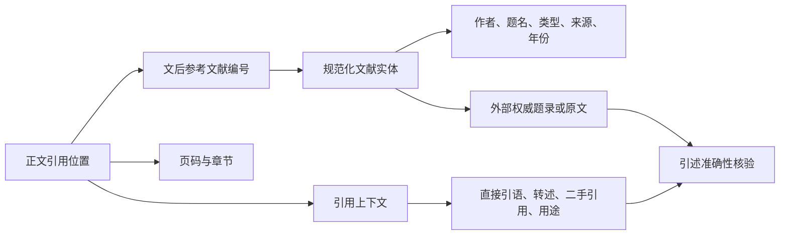

# 学位论文参考文献与正文引用映射工作流

## 一、目标

把一篇硕士或博士论文中的参考文献系统转换为可追溯的数据资产，建立以下映射：



最终需要回答：

1. 论文文后列出了哪些参考文献？
2. 去重后实际有多少个独立文献实体？
3. 每篇文献在正文哪些页、哪些章节被引用？
4. 引用位置附近具体写了什么？
5. 引用承担什么作用？
6. 是否存在重复编号、文后有条目但正文未检出、正文有编号但文后无条目等异常？

逐篇取得被引文献原文并核验引述准确性不属于默认范围；只有用户明确要求时才执行。

## 二、适用范围

- 可搜索文本型PDF的硕士论文、博士论文。
- 扫描型PDF，但必须先OCR并保留OCR置信度与人工抽查记录。
- 顺序编码制，如`[1]`、`[2-4]`、`[2,5,8]`。
- 著者—年份制，如`（张三，2020）`、`(Smith, 2021)`，需切换匹配规则。
- 只做书目清点、正文引用映射，或进一步做“论文引用内容—被引文献原文”核验。

不适用于仅凭论文题名或摘要推测参考文献；没有取得全文时，只能登记待处理状态。

## 三、不可越过的边界

1. 不编造作者、题名、年份、DOI、页码或原文。
2. “正文未检出”不等于“作者未引用”。
3. 文后编号数不等于独立文献数。
4. 论文参考文献表中的书目信息不等于已经通过出版方或数据库核验。
5. 句子中带引号不自动等于严格意义上的直接引语。
6. 论文中的引用内容不自动等于被引文献原文的真实观点。
7. AI可以提取、查重、分类和提示异常，但引述准确性必须回到被引文献原文核验。
8. 扫描件、脚注、图片、公式和版式异常造成的缺失必须保留为缺失，不得猜测补齐。
9. 原始PDF只读保存；清洗文本、映射表和人工修订另存新版本。
10. 涉及未公开论文、学生信息或内部材料时，先确认使用权限和脱敏要求。

## 四、标准产物

每篇论文至少形成以下文件：

| 文件 | 一行代表什么 | 必备字段 |
|---|---|---|
| `论文简称_参考文献总表.csv` | 一个文后编号 | 编号、实体ID、完整书目、作者、题名、类型、来源、年份、正文次数、论文页码、匹配状态、元数据核验状态 |
| `论文简称_规范化文献实体.csv` | 一篇去重后的独立文献 | 实体ID、关联编号、规范书目、查重依据、外部核验状态 |
| `论文简称_正文引用位置.csv` | 一次正文引用出现 | 编号、实体ID、PDF页、论文页、章节、引用上下文、引用方式、引用用途、匹配置信度 |
| `论文简称_参考文献引用映射.json` | 完整机器可读映射 | 论文元数据、统计、书目、实体、引用位置、异常项 |
| `日期_论文简称_参考文献引用映射.md` | 人工可读报告 | 范围、结果、异常、方法、限制、数据文件链接 |
| `日期_论文简称_参考文献引用映射复核记录.md` | 独立复核 | 原文抽查、计数校验、异常修正、允许使用范围 |

用户明确要求逐篇核验被引原文时，才增加：

| 文件 | 用途 |
|---|---|
| `论文简称_引述原文核验.csv` | 将论文引用内容与被引文献原文逐条对照 |
| 每篇被引文献正式笔记 | 一篇文献一条记录，保存权威元数据、原文入口和核验状态 |

## 五、字段字典

### 5.1 参考文献总表

| 字段 | 含义 | 规则 |
|---|---|---|
| `reference_label` | 论文中的文后编号 | 保留原编号，不因去重而改写 |
| `entity_id` | 规范化文献实体ID | 如`E001`，重复编号可指向同一实体 |
| `reference_text` | 论文文后原始书目 | 尽量保留原貌 |
| `authors` | 作者 | 只按可见书目提取，未核验则标记 |
| `title` | 题名 | 不擅自补全 |
| `document_type` | J、D、M、C、A等 | 原表缺失时保持缺失 |
| `source_container` | 期刊、学校、出版社或论文集 | 不等同于外部核验 |
| `year` | 出版或完成年份 | 无法判断则缺失 |
| `citation_count` | 正文匹配次数 | 按出现位置计数 |
| `thesis_pages` | 论文正文页码 | 多页用列表或逗号分隔 |
| `mapping_status` | 已匹配/未检出/无文后条目/需复核 | 使用限定词 |
| `metadata_verification` | 元数据核验状态 | 仅据论文原表/已由数据库核验/已由原文核验 |

### 5.2 正文引用位置表

| 字段 | 含义 |
|---|---|
| `reference_label` | 正文出现的引用编号 |
| `entity_id` | 对应的去重文献实体 |
| `pdf_page` | PDF文件物理页码 |
| `thesis_page` | 论文印刷页码 |
| `section` | 章节或小节 |
| `citation_context` | 引用标记所在句，必要时扩展到前后句 |
| `citation_mode` | 直接引语候选/转述/综述性并列引用/二手引用候选/无法判断 |
| `citation_purpose` | 背景、概念、理论、方法、工具、数据对照、政策、反例等 |
| `mapping_confidence` | 高/中/低，并说明原因 |

### 5.3 引述原文核验表

| 字段 | 含义 |
|---|---|
| `occurrence_id` | 正文引用位置唯一ID |
| `citing_context` | 论文中的引用内容 |
| `source_document` | 被引文献规范题名 |
| `source_locator` | 被引文献页码、章节、段落、表图号 |
| `source_excerpt` | 合规长度的原文证据或准确释义 |
| `relationship` | 直接支持/部分支持/不支持/无法判断 |
| `citation_form` | 直接引语/准确转述/扩张转述/二手引用/疑似错引 |
| `review_note` | 差异、限定条件与核验意见 |
| `verification_status` | 未核验/机器初核/人工复核/完成 |

## 六、完整执行流程

### 阶段0：接收与登记

1. 复制论文PDF到研究仓库的只读原始资料目录。
2. 登记题名、作者、学校、学位类型、专业、导师、完成时间、来源和权限。
3. 计算文件哈希或至少登记文件名、大小、页数，避免版本混淆。
4. 判断是否含学生姓名、学号、联系方式、访谈身份等敏感内容。
5. 建立论文文献卡，状态设为“处理中/部分核验”，不得预先标记完成。

阶段门：

- [ ] 原始文件可打开且版本明确。
- [ ] 权限和敏感级别明确。
- [ ] 原件未被覆盖。

### 阶段1：PDF可读性与页码基线

1. 获取PDF总页数、是否加密、是否允许文本复制。
2. 抽取封面、目录、正文首页、参考文献首页和末页文本。
3. 判断是原生文本还是扫描OCR。
4. 建立PDF页码与论文印刷页码换算关系。
5. 对页码偏移发生变化的前置页、插页、横向页或附录单独登记。

建议记录：

| 区域 | PDF页范围 | 论文页范围 | 换算规则 |
|---|---|---|---|
| 前置部分 | | 罗马页码/无页码 | 不强行换算 |
| 正文 | | | `论文页 = PDF页 + 偏移量` |
| 参考文献 | | | 单独登记 |
| 附录 | | | 单独登记 |

阶段门：

- [ ] 正文和参考文献页范围已确定。
- [ ] 页面换算经至少3个位置抽查。
- [ ] OCR或文本层风险已标记。

### 阶段2：参考文献表提取

1. 定位“参考文献”“References”或同类标题。
2. 按编号或著者—年份边界切分条目。
3. 合并跨行、跨页条目。
4. 保留论文原始书目文本。
5. 拆分作者、题名、文献类型、来源、年份、卷期页码、DOI等字段。
6. 不确定字段保持缺失，并记录解析置信度。
7. 对参考文献首页、跨页处、末页进行视觉核对。

特殊情况：

- 同一行出现多个编号：分别保留编号，再判断是否共用一条书目。
- 编号断序：记录缺号，不自动补条目。
- 一条书目跨页：以视觉版面和语义连续性确认。
- 中英文标点混用：原文层保留，规范化层另建。
- 无编号参考文献：以作者、年份、题名组合生成临时ID。

阶段门：

- [ ] 文后条目首号、末号、条目数和缺号已核对。
- [ ] 每条原始书目都可回到PDF页定位。
- [ ] 没有凭空补齐残缺字段。

### 阶段3：文献实体规范化与查重

查重顺序：

1. DOI、ISBN、CNKI学位论文编号等稳定标识完全一致。
2. 规范化题名完全一致。
3. 第一作者、年份、题名核心字符串一致。
4. 题名相同但版本不同，保留不同实体并建立版本关系。
5. 仅主题相近不能合并。

规范化仅用于比对，不覆盖原文：

- 统一全角半角、空格和常见标点。
- 英文题名可统一大小写后比对。
- 去除不影响身份判断的卷期格式差异。
- 保留作者顺序、年份和版本差异。

重复处理：

- 多个编号指向同一书目：多个`reference_label`映射到同一`entity_id`。
- 同一文献的不同版本：建立`is_version_of`关系，不直接合并。
- 无法确认：保留两个实体，标记“疑似重复”。

阶段门：

- [ ] 编号数与实体数分别统计。
- [ ] 每次合并都有可说明的查重依据。
- [ ] 疑似重复没有被强制合并。

### 阶段4：正文引用标记提取

顺序编码制需要识别：

- 单一编号：`[4]`
- 连续范围：`[2-5]`
- 并列编号：`[2,5,8]`、`[2，5，8]`
- 组合形式：`[2-4,8]`
- 上标或脚注形式：根据PDF文本层单独定制

范围展开规则：

- `[2-5]`展开为2、3、4、5，但保留原始标记`[2-5]`。
- 一处并列引用是一处引用事件，同时产生多个“事件—文献”关系。
- 正文中的公式编号、图号、问卷题号不得误识别为文献引用。

著者—年份制需要识别：

- 中文作者与年份。
- 英文作者、`et al.`和年份后缀，如2020a、2020b。
- 同一括号中的多篇文献。
- 正文作者叙述与括号年份组合。

每个引用事件记录：

1. 原始引用标记。
2. PDF页和论文页。
3. 章节。
4. 所在句。
5. 必要时前后句。
6. 对应文后编号或文献实体。
7. 匹配置信度与异常说明。

阶段门：

- [ ] 引用模式覆盖论文实际格式。
- [ ] 已排除明显的公式、表图和题号误报。
- [ ] 每个正文引用都能回到具体页面。

### 阶段5：引用上下文切分

默认取引用标记所在完整句；以下情况扩大范围：

- 引用标记位于段末，而主张跨越前两句。
- 冒号后是引语。
- 引号在上一句开始。
- 一段连续综述由多个句子共同对应同一编号。
- 表格或图注中的引用需要保留表图标题。

上下文必须分层保存：

| 层 | 内容 |
|---|---|
| 原始上下文 | PDF文本层直接抽取，保留可追溯性 |
| 清洗上下文 | 去页眉、合并断行、修复明显空格 |
| 分析者解释 | 引用作用、主张类型、疑点 |

不得用清洗文本覆盖原始上下文。

### 阶段6：引用方式与用途初步编码

引用方式建议编码：

- `direct_quote_candidate`：出现明确引号、冒号引语或页码标注，仍需原文核验。
- `paraphrase`：作者用自己的语言概述。
- `synthesis`：同一主张并列多篇文献。
- `secondary_citation_candidate`：出现“转引自”“引自”“某某认为”等线索。
- `unclear`：上下文不足。

引用用途建议编码：

- 研究背景或问题提出。
- 概念界定。
- 国内外研究现状。
- 理论基础。
- 研究方法依据。
- 工具、量表或指标来源。
- 技术事实或应用依据。
- 政策、课程标准依据。
- 数据比较。
- 结果解释。
- 反例或限制。

机器分类只作为候选标签。正式统计前，至少由人工抽查所有“直接引语候选”“二手引用候选”和低置信度记录。

### 阶段7：双向一致性检查

必须同时运行：

1. 文后有条目，正文未检出。
2. 正文有编号，文后无条目。
3. 正文编号超出文后最大编号。
4. 同一编号对应多个不同书目。
5. 多个编号对应同一书目。
6. 连续编号缺号。
7. 参考文献表重复条目。
8. 同一实体在正文的次数与页码聚合是否一致。
9. 直接引语候选是否缺少具体页码。
10. 引用位置是否高度集中在绪论而在方法、结果、讨论中缺失。

异常只能报告，不替作者修正论文。

### 可选阶段8：外部元数据核验

本阶段不属于默认工作流。只有用户明确要求核验权威题录时才执行。

每个规范化实体优先使用：

1. 出版社、期刊官网、学校机构库。
2. DOI、Crossref或其他权威标识注册记录。
3. CNKI、万方、维普等正式数据库记录。
4. 图书馆馆藏和国家标准、政策发布机关。
5. 其他可复核来源。

逐项核验作者、题名、年份、类型、来源、卷期页码、DOI或数据库编号。发现差异时同时保留：

- `reference_text_as_printed`：论文原表。
- `verified_citation`：权威来源核验后的规范引文。
- `metadata_discrepancy`：差异说明。

没有访问到权威来源时，状态保持`unverified`，不得由搜索摘要或AI猜测补全。

### 可选阶段9：引述原文核验

本阶段不属于默认工作流。只有用户明确要求核验引用准确性，并已取得被引文献全文时才执行。

对每个正文引用事件：

1. 打开对应被引文献全文。
2. 根据关键词和主张检索候选原文。
3. 记录被引文献页码、章节、段落或表图号。
4. 比较论文表述与来源原意。
5. 判定支持关系与引用形式。
6. 记录限定条件是否被省略、语义是否扩大、因果是否被强化。

判定标准：

| 结果 | 含义 |
|---|---|
| 直接支持 | 来源原文明确信息与论文表述一致 |
| 部分支持 | 核心方向一致，但范围、条件或强度不同 |
| 不支持 | 来源没有该主张或与之相反 |
| 二手引用 | 论文实际引用的是另一作者对原文的转述 |
| 无法判断 | 没有全文、定位失败或上下文不足 |

直接引语还要核对文字、删节、标点、页码和译文。无法找到对应原文时，不得写成“已核验”。

### 阶段10：报告、入库与复核

报告至少包含：

- 论文基本信息和处理范围。
- 编号数、实体数、引用事件数和涉及文献数。
- 重复/共用编号组。
- 文后有条目但正文未检出项。
- 正文有引用但文后无条目项。
- 引用用途与章节分布。
- 高风险引用候选。
- 外部元数据核验进度。
- 引述原文核验进度。
- 数据文件和原始PDF链接。
- 方法、误差来源和使用边界。

独立复核必须回到原始PDF，并抽查：

- 参考文献首页、跨页处和末页。
- 至少3组正常映射。
- 全部重复或共用编号。
- 全部“正文未检出”编号。
- 全部“正文有标记、文后无条目”异常。
- 全部直接引语候选和二手引用候选。
- 低置信度上下文。

完成论文内部映射并建立独立复核记录后，默认任务即可标记完成。未取得被引文献原文时，报告写明“未执行引述准确性核验”，但不影响论文内部映射的完成状态。

## 七、质量指标

| 指标 | 计算 | 建议门槛 |
|---|---|---|
| 参考文献解析覆盖率 | 成功解析编号数/文后可见编号数 | 100%，否则列出缺失 |
| 正文映射成功率 | 能映射到文后条目的正文引用关系数/正文引用关系总数 | 100%或列出异常 |
| 页面定位完整率 | 有PDF页与论文页的引用事件数/全部引用事件数 | 100% |
| 实体查重确认率 | 已确认非重复或已合并实体数/全部实体数 | 100%或标疑似 |
| 元数据核验率 | 已由权威来源核验实体数/全部实体数 | 单独报告，不强行补齐 |
| 原文核验率 | 已核对被引原文的引用事件数/全部引用事件数 | 单独报告 |
| 人工抽查覆盖率 | 已人工回看事件数/全部引用事件数 | 风险抽查100%，普通项按方案 |

禁止用一个“总准确率”掩盖不同阶段的完成度。

## 八、状态模型

| 状态 | 条件 |
|---|---|
| `captured` | 已收到论文，尚未提取 |
| `text_extracted` | 已建立可检索文本和页码基线 |
| `internally_mapped` | 已完成论文内部“文后—正文”映射 |
| `metadata_partially_verified` | 部分实体已由权威来源核验 |
| `source_text_partially_verified` | 部分引用已与被引原文核对 |
| `reviewed` | 已建立独立复核记录 |
| `completed` | 默认的论文内部映射与独立复核已经完成，所有高严重度问题已关闭 |

报告中必须说明“完成”的具体范围。

## 九、常见失败模式

| 失败模式 | 风险 | 处理 |
|---|---|---|
| 把47个编号写成47篇文献 | 重复计数 | 增设规范化实体层 |
| 只导出参考文献表 | 无法知道正文如何使用 | 建立引用事件表 |
| 只截引用句，不保存页码 | 无法回查 | 同时保存PDF页与论文页 |
| 把带引号句都判为直接引用 | 类型误判 | 标记为候选并回原文核验 |
| 把未检出写成未引用 | 过度断言 | 使用限定词并抽查版式 |
| 依据论文书目自动补DOI | 可能编造 | 外部权威来源核验 |
| 用搜索摘要代替被引原文 | 无法验证语义 | 保持无法判断 |
| 清洗文本覆盖原始文本 | 丧失证据链 | 原始层与清洗层分开 |
| 并列编号只记为一个引用 | 丢失关系 | 保留事件并展开事件—文献关系 |
| 没有独立复核就标完成 | 错误进入正式研究 | 强制复核记录 |

## 十、最小自动化逻辑

```text
输入PDF
→ 获取页数与文本层
→ 确定正文、参考文献、附录范围
→ 解析文后书目
→ 建立原编号表
→ 规范化题名与书目查重
→ 生成实体ID
→ 提取正文引用事件
→ 展开连续与并列编号
→ 截取上下文并记录双页码
→ 双向一致性检查
→ 导出CSV和JSON
→ 视觉抽查与独立复核
→ 外部元数据核验
→ 被引原文逐条核验
```

自动化程序每次运行必须输出：

- 输入文件路径与文件指纹。
- 解析范围。
- 参考文献编号数和实体数。
- 引用事件数与引用关系数。
- 未映射项、未检出项和重复组。
- 运行时间、脚本版本和处理日志。

## 十一、仓库落位

教科研数据仓库：`/Users/wangzirui/教科研数据仓库`

- 论文原件：`60_原始资料/文献原文`
- 论文文献卡：`30_研究资料/03_参考文献`
- 映射报告与CSV/JSON：`30_研究资料/03_参考文献/引用映射`
- 独立复核记录：`30_研究资料/08_材料分解`
- 参考文献统一入口：`30_研究资料/03_参考文献/参考文献数据整理入口.md`
- 完整材料分解工作流：`05_工作流/教科研材料数据化分解工作流.md`

本工作流是[[教科研材料数据化分解工作流]]的“参考文献与引用证据”专项分支。

## 十二、推荐调用语句

### 只做论文内部映射

> 按“学位论文参考文献与正文引用映射工作流”处理这篇论文。提取全部文后参考文献，建立去重文献实体，定位正文每一处引用及上下文，输出CSV、JSON、映射报告和独立复核记录。保留PDF页与论文页，不联网补造元数据。

### 可选：做到外部来源核验

> 在完成论文内部映射后，继续逐条核验规范化文献实体的权威题录，并将每一处引用内容与被引文献原文对应。区分直接引语、转述、二手引用、部分支持、不支持和无法判断；没有原文的保持未核验。

### 仅查看异常

> 检查这篇论文的参考文献异常：重复或共用编号、文后有条目但正文未检出、正文有标记但文后无条目、直接引语缺页码、疑似二手引用和元数据冲突。只报告证据和位置，不替作者修正。

## 十三、完成检查表

- [ ] 原始PDF已只读保存并登记版本。
- [ ] 正文、参考文献和附录范围已确认。
- [ ] PDF页与论文页换算已抽查。
- [ ] 全部文后条目已解析或列出失败项。
- [ ] 原始编号与规范化实体分层保存。
- [ ] 连续和并列引用已正确展开。
- [ ] 每个引用事件都有页面、章节和上下文。
- [ ] 双向一致性异常已完整列出。
- [ ] 机器分类与人工判断已区分。
- [ ] 已明确记录外部元数据核验是否属于本次范围；默认不执行。
- [ ] 已明确记录被引原文核验是否属于本次范围；默认不执行。
- [ ] 原始文本、清洗文本和分析解释未混写。
- [ ] CSV、JSON和Markdown可解析。
- [ ] 独立复核记录已建立。
- [ ] 高严重度问题已关闭或明确接受限制。
- [ ] 没有编造文献、引文、DOI、页码或结论。

## 关联

- [[教科研材料数据化分解工作流]]
- [[../04_项目/教科研数据仓库]]
