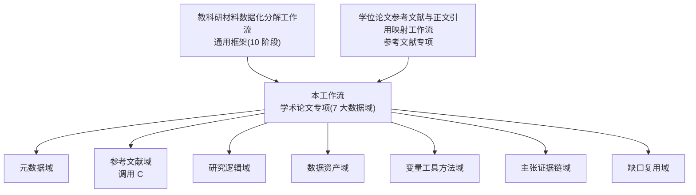

# 学术论文教科研数据分解工作流-Zcode版

## 一、目标与定位

> [!important] 一句话目标
> 把一篇学术论文丢进来,按本工作流把**七大数据域**全部拆成可追溯、可复核的教科研数据资产——不只是参考文献,也不仅是摘要。

本工作流是 [[教科研材料数据化分解工作流]] 的"学术论文专项一站式落地"。与已有两个工作流的关系:

- **上位**: [[教科研材料数据化分解工作流]] 提供通用 10 阶段框架、十层级原始参照、复核对照材料、入库分发规则。
- **参考文献专项**: [[学位论文参考文献与正文引用映射工作流]] 已规定文后书目提取、实体规范化、正文引用映射、双向一致性、外部核验的完整流程,本工作流**直接调用,不重写**。
- **本工作流职责**: 规定学术论文 7 大数据域的分解顺序、产物字段、四类型分流、总报告结构、完成判据,使一篇论文能被完整分解。

### 适用材料类型

| 类型 | 典型 | 分解重点 |
|---|---|---|
| 硕博学位论文 | 期刊外的完整论文、附录、数据表 | 完整研究设计、量表、附录原始数据、长篇文献综述 |
| 期刊实证研究 | 期刊论文、会议实证论文 | 样本、变量、统计结果、方法匹配、结论边界 |
| 理论/综述/观点 | 理论文章、文献综述、课标解读、政策评论 | 概念框架、理论主张—文献证据、政策引文核验 |
| 会议论文/案例报告 | 单案例、教学案例、行动报告 | 案例情境、过程证据、工程过程、可迁移性 |

四类型在各阶段的差异见 [[#六、四类型分流]]。

## 二、不可越过的边界

沿用教科研数据仓库 AGENTS.md 的写入规则和 AI 使用边界,补充学术论文特有约束:

1. 不编造作者、题名、年份、DOI、文号、引文页码、统计量、量表信效度或样本量。
2. 未取得被引文献原文时,引用核验状态保持 `未核验`,不得由搜索摘要或 AI 猜测补全。
3. "作者明确写出"与"分析者推断"必须分开;作者观点、受访者观点、研究结论必须分开。
4. 复合剪藏(一篇本地文件混入多来源内容)必须先拆分来源单元,再分别建立文献记录。
5. 数据三态——"实际呈现""作者声称存在""推断应存在"——使用不同状态标记,缺失保持缺失。
6. 教案、课件、学习单等教学材料产生的是"设计数据"和"数据采集机会",不得写成"课堂已真实发生"。
7. 学生交流数据只使用匿名代码,区分学生原话、教师概述和教师解释。
8. 原始 PDF 只读保存;清洗文本、结构化转录和人工修订另存新版本,不覆盖原件。
9. 显著性不等于教育意义;相关关系不自动等于因果关系;没有呈现的过程不能视为已完成。
10. 涉及未公开论文、学生信息或内部材料时,先确认使用权限和脱敏要求,再进入处理。

## 三、七大数据域总览

| 数据域 | 核心问题 | 主要产物 | 责任阶段 |
|---|---|---|---|
| D1 元数据与来源 | 这篇论文是什么、来自哪里、权限如何 | 来源总卡 | 阶段 2 |
| D2 参考文献与正文引用 | 引了哪些文献、在正文哪里引、引了什么 | 参考文献总表、实体表、引用位置表、映射 JSON | 阶段 3(调用专项工作流) |
| D3 研究逻辑 | 为什么做、做什么、怎么做 | 研究逻辑章节 | 阶段 4 |
| D4 数据资产 | 实际有哪些数据、声称有哪些、应该有哪些 | 数据资产清单、结构化数据表 | 阶段 5 |
| D5 变量工具方法 | 测什么、用什么测、方法是否站得住 | 变量字典、工具审计表、方法审计表、内部不一致表 | 阶段 6 |
| D6 主张—证据链 | 得出什么结论、证据在哪、有多强 | 主张证据链表 | 阶段 7 |
| D7 缺口与复用 | 缺什么、能借鉴什么、自己要重采什么 | 数据缺口表、复用价值与迁移规划 | 阶段 7 |

## 四、标准产物清单(分层:核心锁死,扩展灵活)

### 4.1 核心产物(锁死字段)

> 一篇论文处理完,以下文件必备,字段不得增减。

**`论文简称_来源总卡.csv`** — 一篇论文一行

| 字段 | 含义 | 规则 |
|---|---|---|
| `paper_id` | 论文唯一 ID | 内部编号,如 P001 |
| `title` | 题名 | 按论文封面/题名页,不擅自补全 |
| `authors` | 作者 | 多作者用分号分隔 |
| `institution` | 机构 | 学校或期刊所属机构 |
| `degree_or_journal` | 学位类型或期刊名 | 硕士/博士/期刊名/会议名 |
| `advisor_or_editor` | 导师或责编 | 无则缺失 |
| `year` | 完成或出版年份 | 无法判断则缺失 |
| `doi_or_identifier` | DOI、文号、CNKI 编号 | 未核验则标缺失 |
| `research_type` | 研究类型 | 实证/理论/综述/案例/课程开发 |
| `stage_and_subject` | 学段与学科 | 如"高中技术与工程" |
| `source_verification` | 来源核验状态 | 仅据论文/已由数据库核验/已由原文核验 |

**`论文简称_数据资产清单.csv`** — 一类数据一行

| 字段 | 含义 |
|---|---|
| `asset_id` | 资产 ID,如 D01 |
| `data_domain` | 数据域(D1-D7 或量化/质性/学生交流/工程过程/教学实施/外部证据) |
| `asset_name` | 数据名称 |
| `status` | 实际呈现/作者声称/应存在/缺失 |
| `source_location` | 来源位置(页码、章节、表图号) |
| `sample_scope` | 样本范围 |
| `tool_fields` | 工具与字段 |
| `processing` | 处理过程 |
| `reproducibility` | 可复核性(高/中/低/不可复核) |

**`论文简称_论文报告量化结果.csv`** — 一个量化指标一行

> 把论文中所有散见的量化结果(KMO、alpha、均值、P值、百分比、样本量、合格率等)单独提取成索引表,可独立复算和核验。不得只写在总报告正文里。

| 字段 | 含义 | 规则 |
|---|---|---|
| `data_domain` | 数据域 | 课程需求问卷/教学效果问卷/创造性倾向/作品评价等 |
| `metric` | 指标名称 | 如"KMO""Cronbach's alpha""前测均值" |
| `value` | 数值 | 保留原文报告值,不四舍五入 |
| `unit_or_denominator` | 单位或分母 | 如"人""份""%"或"27人" |
| `sample` | 样本 | 如"25人""135份" |
| `analysis_method` | 分析方法 | 如"配对样本T检验""频数分析" |
| `evidence_location` | 证据位置 | 论文页码、表图号 |
| `verification_note` | 核验说明 | 如"论文报告值""与表X一致""统计量不全" |

**`论文简称_主张证据链.csv`** — 一条主张一行(索引)

| 字段 | 含义 |
|---|---|
| `claim_id` | 主张 ID,如 C01 |
| `claim` | 研究主张 |
| `raw_data` | 原始数据 |
| `analysis` | 分析过程 |
| `evidence_location` | 证据位置 |
| `counterexample_limit` | 反例与限制 |
| `support_level` | 强/中/弱/不支持 |
| `verification_status` | 未核验/机器初核/人工复核/完成 |

**`YYYY-MM-DD_论文简称_主张证据链.md`** — 人工可读展开(对核心主张展开证据解释)

> CSV 做机器可处理索引,MD 做人工阅读展开。MD 必含:证据链总表(同 CSV)、关键证据解释(对 2-5 条核心主张展开统计量/合格率/前后测等细节)、综合解释、不应做出的过度推论、对教学实践的可执行建议。

**`论文简称_数据缺口.csv`** — 一个缺口一行

| 字段 | 含义 |
|---|---|
| `gap_id` | 缺口 ID |
| `gap_description` | 缺口描述 |
| `impact` | 对结论的影响 |
| `can_paper_supply` | 能否由论文补充(能/部分/否) |
| `suggested_action` | 建议动作 |

**`论文简称_内部不一致.csv`** — 一项不一致一行

| 字段 | 含义 |
|---|---|
| `inconsistency_id` | 不一致 ID |
| `description` | 描述 |
| `location_a` | 位置 A |
| `location_b` | 位置 B |
| `impact` | 影响 |
| `handling` | 处理方式(保留冲突/需作者澄清/已修正) |

**`YYYY-MM-DD_论文简称_数据化分解.md`** — 人工可读总报告,章节结构见 [[#七、总报告章节结构(锁死)]]。

**`YYYY-MM-DD_论文简称_数据化分解复核记录.md`** — 独立复核,模板见教科研仓库 `90_模板/教科研材料数据化复核记录模板`。

### 4.2 参考文献域产物(调用专项工作流)

参考文献与正文引用的 6 个产物文件、字段字典、质量指标,全部按 [[学位论文参考文献与正文引用映射工作流]] 第四节、第五节、第七节执行,本工作流不重写。包括:

- `论文简称_参考文献总表.csv`
- `论文简称_规范化文献实体.csv`
- `论文简称_正文引用位置.csv`
- `论文简称_参考文献引用映射.json`
- `YYYY-MM-DD_论文简称_参考文献引用映射.md`
- `YYYY-MM-DD_论文简称_参考文献引用映射复核记录.md`
- `论文简称_引用内容明细.md`(人工可读引用内容清单,结构见 [[参考文献映射字段规范-Zcode版]] 第十一章)

### 4.3 迁移数据规划(独立产物,所有类型必做)

> [!important] 独立文件要求
> 迁移数据规划必须作为独立文件 `迁移XXX论文的高中技术与工程真实数据规划.md` 存入 `40_真实数据/01_数据规划`,不得只写在总报告第 10 章。来源论文的数据不得作为本课堂数据使用。

文件最小结构:

| 章节 | 内容 |
|---|---|
| 研究问题—证据矩阵 | 每个迁移研究问题对应:需要证明什么、最小必要数据、补充数据、分析方法 |
| 采集计划表 | 每项数据对应:对象/样本、工具、时间与频率、责任人、保存位置(`40_真实数据` 子目录) |
| 来源论文的复用边界 | 明确哪些可借鉴、哪些需修改、哪些不可直接使用 |
| 自己课堂需重新采集的数据清单 | 区分于来源论文数据 |

### 4.4 扩展产物(给模板,不锁死字段)

| 产物 | 适用类型 | 说明 |
|---|---|---|
| 变量与指标字典 | 硕博/实证必做,理论综述可选 | 自变量/因变量/控制/背景/混杂;操作性定义;可观察指标;定义风险 |
| 工具与方法审计表 | 硕博/实证必做,理论综述可选 | 量表/问卷/测试/访谈/观察表/作品量规;来源、信度、效度、评分者一致性 |
| 教学材料附加分析 | 论文含教案/课程设计时 | 目标—活动—评价—证据矩阵;设计数据 vs 实施数据;按教科研工作流"教学材料专用分支" |
| 结构化数据表 | 论文含表/统计结果时 | 表、图、统计结果转 CSV,保留表头、单位和数据关系 |

## 五、完整执行流程

### 阶段 0:接收、安全与授权

按 [[教科研材料数据化分解工作流]] 阶段 0 执行,补充:

1. 登记论文来源(公开学位论文、期刊数据库、会议论文集、作者授权、内部资料)。
2. 确认数据库使用权限和版权范围(CNKI、万方、维普、JSTOR、学校机构库等)。
3. 涉及未公开论文或含学生数据的论文,先完成脱敏和权限确认,再进入处理。

**阶段门 G0**

- [ ] 输入文件清单完整,文件可打开。
- [ ] 权限和敏感级别明确。
- [ ] 原件只读保存,未被覆盖。

### 阶段 1:文本化与证据定位

按 [[教科研材料数据化分解工作流]] 阶段 2 执行,补充:

1. 建立 PDF 物理页 ↔ 论文印刷页换算关系,至少抽查 3 个位置确认。
2. 前置部分(封面、目录、摘要)用罗马页码或无页码,不强行换算。
3. 附录、量表、数据表、访谈提纲、编码表单独登记页码范围。
4. OCR 结果必须与原图抽查核对,低置信度区域标记。
5. 表格保留表头、单位和数据关系,不得只转成自然语言。

**阶段门 G1**

- [ ] 正文、参考文献、附录范围已确认。
- [ ] PDF 页与论文页换算已抽查。
- [ ] OCR、表格、公式的高风险位置已复核。
- [ ] 没有把 AI 转述当成原文。

### 阶段 2:来源总卡与元数据核验

1. 从论文封面、版权页、题名页提取:题名、作者、机构、学位类型/期刊名、导师/责编、年份、DOI 或文号、专业、研究方向。
2. 标记每个元数据字段的来源(论文封面/版权页/数据库记录)。
3. 默认不联网核验;用户明确要求时,按 [[学位论文参考文献与正文引用映射工作流]] 可选阶段 8 执行外部元数据核验。
4. 复合剪藏必须先拆分来源单元,每个单元单独建文献记录,不得合并归属。
5. 建立论文文献卡,状态设为"处理中/部分核验"。

**阶段门 G2**

- [ ] 元数据字段完整或已标缺失。
- [ ] 每个字段有来源标记。
- [ ] 复合剪藏已拆分来源,作者归属无混淆。
- [ ] 论文文献卡已建立,状态未预先标记完成。

### 阶段 3:参考文献与正文引用映射(调用专项工作流)

> [!note] 调用关系
> 本阶段**直接调用** [[学位论文参考文献与正文引用映射工作流]],不重写其内容。字段取值和结构按 [[参考文献映射字段规范-Zcode版]] 锁死执行,确保不同批次产出可对比。

- **输入**: 可检索文本、页码基线、参考文献与附录页范围。
- **执行**: 该工作流阶段 2-7——文后书目提取 → 文献实体规范化与查重 → 正文引用标记提取 → 引用上下文切分 → 引用方式与用途编码 → 双向一致性检查。
- **字段规范**: citation_mode(5类中文)、citation_purpose(8类中文)、citation_context(句级切分)、实体表5列、JSON嵌套结构、metadata_verification统一措辞——全部按 [[参考文献映射字段规范-Zcode版]] 执行。
- **输出**: 该工作流第四节规定的 6 个文件。
- **衔接判据**: 论文内部映射完成 + 参考文献映射独立复核记录建立,本阶段才算完成。
- **可选延伸**(用户明确要求才做):
  - 可选阶段 8:外部权威题录核验(DOI、Crossref、CNKI 等)。
  - 可选阶段 9:被引文献原文逐条核验(区分直接支持/部分支持/不支持/二手引用/无法判断)。

**阶段门 G3**(引用该工作流第七节质量指标)

- [ ] 参考文献解析覆盖率 100% 或列出缺失。
- [ ] 正文映射成功率 100% 或列出异常。
- [ ] 页面定位完整率 100%。
- [ ] 实体查重确认率 100% 或标疑似。
- [ ] 双向一致性异常已完整列出(文后有正文未检出、正文有文后无、重复编号、缺号等)。
- [ ] 参考文献映射独立复核记录已建立。

### 阶段 4:研究逻辑提取

按以下结构提取,每项标注证据位置:

1. **现实问题与背景**: 作者识别的问题、政策背景、实践痛点。
2. **研究目标**: 作者明确陈述的目标。
3. **研究问题与假设**: 若论文无正式"研究问题"列表,按作者目标重构分析性研究问题,并明确标注"分析性重构,非作者原句"。
4. **核心概念与理论**: 概念/理论、论文中的作用、操作化程度、证据位置。

| 概念/理论 | 论文中的作用 | 操作化程度 | 证据位置 |
|---|---|---|---|

5. **对象、场景、周期与样本**: 表格化,每行标注风险(样本量、选择偏差、重叠不明等)。

| 数据/活动 | 对象 | 样本 | 时间/周期 | 风险 |
|---|---|---:|---|---|

6. **干预措施或教学策略**: 课程结构、教学方法、实施流程。

**阶段门 G4**

- [ ] "作者明确写出"与"分析者推断"已分开。
- [ ] 每个研究问题能对应潜在证据。
- [ ] 抽象概念已转换为可观察指标或标记为未定义。
- [ ] 样本风险已登记。

### 阶段 5:数据资产盘点

按 6 类逐项登记:

| 数据类别 | 高中技术与工程常见内容 |
|---|---|
| 量化数据 | 前后测、成绩、量规评分、问卷、完成率、时间、成本、测试读数 |
| 质性数据 | 访谈、观察、开放回答、教师日志、学生反思、教研记录 |
| 学生交流数据 | 课堂问答、个别辅导、作品反馈、小组指导、课后交流 |
| 工程过程数据 | 草图、工程图、CAD、方案版本、决策矩阵、原型、测试、迭代 |
| 教学实施数据 | 教师干预、课堂活动、资源条件、实施忠实度、安全记录 |
| 外部证据 | 文献、政策、课程标准、同行案例、专家意见 |

每项数据记录 11 字段:来源、产生者、采集时间、工具、样本、字段/单位、原始位置、处理过程、版本、敏感级别、可复核性。

**三态标记**(必须区分):
- 实际呈现:论文中有数据可查。
- 作者声称存在:论文称使用了但未呈现。
- 推断应存在:研究设计要求但论文未提及。

**结构化转录**: 论文中的表、图、统计结果转 CSV,保留表头、单位和数据关系,文件名 `论文简称_数据表名.csv`。

**阶段门 G5**

- [ ] 三态标记已区分,缺失保持缺失。
- [ ] 每项数据来源和原始位置可追溯。
- [ ] 结构化数据已转录并抽查。
- [ ] 没有补造数据。

### 阶段 6:变量、工具与方法审计

#### 6.1 变量与指标字典

| 变量/概念 | 角色 | 论文中的操作性定义 | 可观察指标 | 数据来源 | 定义风险 |
|---|---|---|---|---|---|

角色:自变量/因变量/控制变量/背景变量/潜在混杂因素。

#### 6.2 工具审计

| 项目 | 论文中的做法 | 证据位置 | 质量判断 | 风险或缺失 |
|---|---|---|---|---|

工具类型:量表、问卷、测试卷、访谈提纲、观察表、作品量规。审计:来源、修订过程、信度、效度、评分者一致性。

#### 6.3 方法审计

- 研究问题与方法是否匹配。
- 样本和分组是否支持结论。
- 统计或质性编码过程是否透明。
- 是否存在选择偏差、测量偏差、实施偏差、选择性报告。

#### 6.4 内部不一致专表

登记口径冲突、结论冲突、选择性报告、数字矛盾等,每项写入 `论文简称_内部不一致.csv`。

#### 6.5 专项审计

对以下情况单独成节:
- 统计量不全(缺 SD、t、df、CI、效应量)。
- 量表结构问题(重复题、维度映射不清、小样本信效度混用)。
- 单班无对照的因果主张。
- 工具适用性未说明。
- 伦理与数据治理说明不足。

**阶段门 G6**

- [ ] 每个变量有定义或明确标记"定义缺失"。
- [ ] 研究方法能够连接到具体数据。
- [ ] 质量风险和替代解释已登记。
- [ ] 内部不一致已逐项列入专表。

### 阶段 7:主张—证据链与缺口复用

#### 7.1 主张—证据链

每条核心结论建一行,写入 `论文简称_主张证据链.csv`:

| 主张 | 原始数据 | 处理与分析 | 证据位置 | 反例/限制 | 支持程度 |
|---|---|---|---|---|---|

**判定原则**:
- 数据存在不等于支持结论。
- 显著性不等于教育意义。
- 相关关系不能自动解释为因果关系。
- 没有呈现的过程不能被视为已经完成。
- 作者观点、受访者观点和研究结论必须分开。

#### 7.2 数据缺口

写入 `论文简称_数据缺口.csv`。重点检查:
- 声称使用但没有呈现的数据。
- 缺少基线、对照、复测或过程记录。
- 缺少工具原件、评分标准或编码规则。
- 缺少原始读数,只呈现汇总结果。
- 结论超出样本、情境或研究周期。

#### 7.3 复用价值

分为五类:
1. 可直接借鉴。
2. 需要修改后使用。
3. 不建议直接使用。
4. 可形成的新研究问题。
5. 自己课堂需要重新采集的数据(写入 `40_真实数据/01_数据规划`)。

**阶段门 G7**

- [ ] 每个核心主张至少链接一项具体证据。
- [ ] 证据位置能够复核。
- [ ] 反例、限制和过度推论已标出。
- [ ] 数据缺口已完整登记。
- [ ] 复用价值分五类,未把他人数据冒充为现场数据。

### 阶段 8:结构化入库

产物分发表(沿用 [[教科研材料数据化分解工作流]] 阶段 8,补充学术论文特有落位):

| 产物 | 入库位置 |
|---|---|
| 原始论文 | `60_原始资料/文献原文` |
| 论文文献卡 | `30_研究资料/03_参考文献` |
| 来源总卡 CSV | `30_研究资料/03_参考文献/引用映射` |
| 参考文献映射 6 文件 | `30_研究资料/03_参考文献/引用映射` |
| 参考文献映射复核记录 | `30_研究资料/08_材料分解` |
| 完整数据化分解报告 | `30_研究资料/08_材料分解` |
| 数据资产清单 CSV | `30_研究资料/08_材料分解/数据表` |
| 论文报告量化结果 CSV | `30_研究资料/08_材料分解/数据表` |
| 数据缺口 CSV | `30_研究资料/08_材料分解/数据表` |
| 内部不一致 CSV | `30_研究资料/08_材料分解/数据表` |
| 其他结构化数据表 | `30_研究资料/08_材料分解/数据表` |
| 主张证据链 CSV | `50_分析与成果/02_证据链` |
| 主张证据链 MD(展开) | `50_分析与成果/02_证据链` |
| 迁移数据规划 MD | `40_真实数据/01_数据规划` |
| 数据化分解复核记录 | `30_研究资料/08_材料分解` |

**命名规范**: `YYYY-MM-DD_论文简称_数据化分解`。

**阶段门 G8**

- [ ] 批次报告与原始材料双向链接。
- [ ] 分拆笔记之间已建立双链。
- [ ] `record_type`、来源、核验状态和敏感级别完整。

### 阶段 9:独立复核与完成判定

#### 复核基准

- 原始十层级参照: 教科研仓库 `30_研究资料/08_材料分解/教科研材料数据化分解十层级原始参照`。
- 执行检查表: 教科研仓库 `05_工作流/教科研材料数据化分解复核对照材料`。
- 复核记录模板: 教科研仓库 `90_模板/教科研材料数据化复核记录模板`。

#### 复核原则

1. 复核必须回到原始文件,不得只看摘要和分解报告。
2. 尽量由另一名人员、另一次独立会话或清空前次结论后执行。
3. 对十层级逐项判定:基础信息、研究逻辑、数据清单、数据来源、变量指标、方法、证据链、缺口、复用价值、入库结果。
4. 状态只使用"通过、部分通过、不通过、不适用、待补材料"。
5. 不一致项必须记录原文位置、严重程度、修正动作和关闭状态。

#### 复核记录最小表格结构(锁死)

复核记录必须包含以下 6 张表,不得省略:

| 表 | 列 | 用途 |
|---|---|---|
| 十层复核总表 | 层级/状态/关键证据位置/不一致或缺失/修正动作/复核后状态 | 逐层判定 |
| 元数据与引用核验表 | 项目/分解结果/原始来源/核验结论 | 元数据逐项核对 |
| 数据资产抽样回查表 | 数据编号/是否真实呈现/来源与过程是否准确/版本处理是否清楚/复核意见 | 抽查关键资产 |
| 关键数字回查表 | 数字/原文位置/分解结果/结论 | 量化结果逐项核对 |
| 主张抽样回查表 | 主张/数据与分析是否匹配/支持程度是否合理/复核意见 | 核心主张判定 |
| 不一致项与修正日志 | 编号/问题/严重程度/原文位置/修正内容/状态 | 不一致闭环 |

#### 必须人工核验

#### 必须人工核验

- 标题、作者、年份、机构、DOI、文号等元数据。
- 引文、页码、表号、图号、统计数字和样本量。
- AI 摘要、OCR、表格识别和质性编码结果。
- 主张支持程度、因果判断、伦理风险和最终结论。

#### 完成标准

只有同时满足以下条件,才可标记 `status: completed`:

- [ ] 原始材料与文件清单完整或已说明缺失。
- [ ] 来源总卡元数据完整或已标缺失。
- [ ] 参考文献内部映射已完成且建立独立复核记录。
- [ ] 研究逻辑、数据资产、变量和方法已经拆解。
- [ ] 教学材料(若有)已检查目标—活动—评价—证据一致性。
- [ ] 涉及学生交流的数据已匿名化,并区分原话、概述和解释。
- [ ] 核心主张都有证据位置和支持程度。
- [ ] 数据缺口、反例和限制已经报告。
- [ ] 内部不一致已逐项登记。
- [ ] AI 生成内容均有核验状态。
- [ ] 已建立独立复核记录,十个层级逐项完成对照。
- [ ] 所有高严重度不一致项已修正或明确接受限制。
- [ ] 无编造数据、文献、引文、页码或政策条款。
- [ ] 无不必要的个人敏感信息。
- [ ] 输出已经写入正确分类,双链无断链。

**阶段门 G9**

- [ ] 十层级逐项完成对照。
- [ ] 高严重度不一致项已修正或明确接受限制。
- [ ] 完成标准全部勾选。

## 六、四类型分流

| 阶段 | 硕博论文 | 期刊实证 | 理论综述 | 会议案例 |
|---|---|---|---|---|
| 阶段 3 参考文献 | 全做,可能含附录量表来源 | 全做 | 全做,重点核政策/课标引文 | 轻量,重点核关键文献 |
| 阶段 4 研究逻辑 | 全做,含完整研究设计 | 全做 | 弱化假设,强化概念框架 | 弱化,强化案例情境 |
| 阶段 5 数据资产 | 全做,含附录原始数据 | 全做,重点统计结果 | 通常无实证数据,标"缺失" | 重点工程过程/案例证据 |
| 阶段 6 变量工具方法 | 全做且最深 | 全做 | 通常无变量,跳过或标 N/A | 轻量 |
| 阶段 7 主张证据 | 全做 | 全做 | 重点理论主张—文献证据 | 重点案例—迁移价值 |
| 教学材料附加分析 | 含教案/课程设计时做 | 通常无 | 无 | 视内容 |
| 复用价值 | 全做 | 全做 | 全做(理论框架迁移) | 全做(案例迁移) |

> [!warning] 类型识别优先
> 阶段 0 接收时必须先判定材料类型。复合剪藏(如课标解读+理论文章拼接)按 [[#阶段 2]] 拆分后,各部分可能属于不同类型,分别按本表执行。

## 七、总报告章节结构(锁死)

`YYYY-MM-DD_论文简称_数据化分解.md` 采用以下章节,顺序不得调整:

0. 批次信息
1. 文件与版本清单
2. 来源总卡(对应 D1)
3. 研究逻辑(对应 D3)
4. 数据资产清单(对应 D4)
5. 变量与指标字典(对应 D5,理论综述可标 N/A)
6. 工具与方法审计(对应 D5,含专项审计和内部不一致)
7. 主张—证据链(对应 D6)
8. 数据缺口(对应 D7)
9. 教学材料附加分析(可选,仅论文含教学材料时)
10. 复用价值(对应 D7)
11. 入库分发
12. AI 处理与人工核验日志
13. 验收(完成标准勾选)

参考文献映射不并入此报告,单独成文 `YYYY-MM-DD_论文简称_参考文献引用映射.md`,并在本报告第 0 章和第 11 章双向链接。

## 八、状态模型

沿用 [[学位论文参考文献与正文引用映射工作流]] 第八节状态模型,补充学术论文分解特有状态:

| 状态 | 条件 |
|---|---|
| `captured` | 已收到论文,尚未提取 |
| `text_extracted` | 已建立可检索文本和页码基线 |
| `metadata_captured` | 来源总卡完成 |
| `internally_mapped` | 参考文献论文内部映射完成 |
| `research_logic_extracted` | 研究逻辑提取完成 |
| `data_assets_inventoried` | 数据资产盘点完成 |
| `variables_methods_audited` | 变量、工具与方法审计完成 |
| `claims_evidence_linked` | 主张—证据链建立 |
| `gaps_reuse_designed` | 缺口与复用价值完成 |
| `reviewed` | 已建立独立复核记录 |
| `completed` | 所有阶段门通过,完成标准全部满足 |

报告中必须说明当前状态和"完成"的具体范围。

## 九、常见失败模式

| 失败模式 | 风险 | 处理 |
|---|---|---|
| 把文后编号数当独立文献数 | 重复计数 | 增设规范化实体层 |
| 只截引用句,不存页码 | 无法回查 | 同时保存 PDF 页与论文页 |
| 把带引号句都判为直接引用 | 类型误判 | 标记为候选并回原文核验 |
| 把"正文未检出"写成"作者未引用" | 过度断言 | 使用限定词并抽查版式 |
| 用搜索摘要代替被引原文 | 无法验证语义 | 保持"无法判断" |
| 清洗文本覆盖原始文本 | 丧失证据链 | 原始层与清洗层分开 |
| 用总分掩盖维度差异 | 评价失真 | 分维度报告,再合成 |
| 把视觉趋势当显著提高 | 统计误判 | 要求 SD、t、df、CI、效应量 |
| 单班无对照当因果结论 | 因果过度推论 | 标记为弱支持,登记替代解释 |
| 复合剪藏不拆来源 | 作者归属混淆 | 先拆分来源单元再分别建卡 |
| 把设计数据当实施数据 | 把教案预设写成课堂已发生 | 严格区分设计/预期/实施三类 |
| 把课标意图写成育人效果 | 政策意图当实证结果 | 区分政策目标与课堂证据 |
| 没有独立复核就标完成 | 错误进入正式研究 | 强制复核记录 |

## 十、完成检查表

汇总所有阶段门与完成标准:

- [ ] G0 接收授权:文件清单、权限、敏感级别、原件只读。
- [ ] G1 文本化:范围确认、页码换算、OCR 复核、无 AI 转述冒充原文。
- [ ] G2 来源总卡:元数据完整或标缺失、来源标记、复合剪藏已拆分。
- [ ] G3 参考文献映射:覆盖率、映射率、定位率、查重率、双向一致性、独立复核记录。
- [ ] G4 研究逻辑:作者写出与分析者推断分开、研究问题对应证据、概念操作化、样本风险。
- [ ] G5 数据资产:三态区分、来源可追溯、结构化转录、无补造。
- [ ] G6 变量工具方法:变量有定义或标缺失、方法连接数据、质量风险登记、不一致入专表。
- [ ] G7 主张证据与缺口复用:证据位置可复核、反例限制已报告、缺口完整、复用分五类。
- [ ] G8 入库:双向链接、双链无断链、record_type 完整。
- [ ] G9 复核:十层级对照、高严重度修正、完成标准全部勾选。
- [ ] 安全:无 API Key/密码/令牌/敏感个人信息。
- [ ] 无编造数据、文献、引文、页码、统计量或结论。

## 十一、仓库落位

教科研数据仓库: `/Users/wangzirui/教科研数据仓库`

| 内容 | 目录 |
|---|---|
| 论文原件 | `60_原始资料/文献原文` |
| 论文文献卡 | `30_研究资料/03_参考文献` |
| 参考文献映射 6 文件 | `30_研究资料/03_参考文献/引用映射` |
| 参考文献统一入口 | `30_研究资料/03_参考文献/参考文献数据整理入口.md` |
| 完整数据化分解报告 | `30_研究资料/08_材料分解` |
| 结构化数据表 | `30_研究资料/08_材料分解/数据表` |
| 十层级原始参照 | `30_研究资料/08_材料分解/教科研材料数据化分解十层级原始参照.md` |
| 主张证据链 | `50_分析与成果/02_证据链` |
| 复用数据规划 | `40_真实数据/01_数据规划` |
| 复核对照材料 | `05_工作流/教科研材料数据化分解复核对照材料.md` |
| 复核记录模板 | `90_模板/教科研材料数据化复核记录模板` |

## 十二、推荐调用语句

### 完整分解(默认)

> 按"学术论文教科研数据分解工作流"处理这篇论文。覆盖 7 大数据域,参考文献部分按"学位论文参考文献与正文引用映射工作流"执行。输出来源总卡、数据资产清单、主张证据链、数据缺口、内部不一致等核心 CSV,参考文献映射 6 文件,总报告和独立复核记录。保留 PDF 页与论文页,不联网补造元数据,缺失保持缺失。

### 仅参考文献映射

> 按"学位论文参考文献与正文引用映射工作流"处理这篇论文。提取全部文后参考文献,建立去重文献实体,定位正文每一处引用及上下文,输出 CSV、JSON、映射报告和独立复核记录。

### 仅某数据域

> 按"学术论文教科研数据分解工作流"的[阶段 X]处理这篇论文,只输出该阶段的产物,不执行其他阶段。

### 含外部来源核验

> 在完成论文内部分解后,继续逐条核验规范化文献实体的权威题录,并将每一处引用内容与被引文献原文对应。区分直接引语、转述、二手引用、部分支持、不支持和无法判断;没有原文的保持未核验。

## 十三、与其他工作流的衔接

| 工作流 | 关系 | 调用点 |
|---|---|---|
| [[教科研材料数据化分解工作流]] | 上位通用框架 | 阶段 0、1、8、9 引用其通用规则、十层级参照、复核对照材料、入库分发 |
| [[学位论文参考文献与正文引用映射工作流]] | 参考文献专项 | 阶段 3 直接调用其阶段 2-7,可选延伸调用其阶段 8-9 |
| 本工作流 | 学术论文一站式完整分解 | 整合 7 大数据域,规定四类型分流和总报告结构 |

> [!important] 定位声明
> 本工作流不替代上述两个工作流,而是在它们之上提供"一篇论文丢进来,所有数据都分析出来"的一站式执行路径。遇到参考文献专项问题以 [[学位论文参考文献与正文引用映射工作流]] 为准,遇到通用框架问题以 [[教科研材料数据化分解工作流]] 为准。
