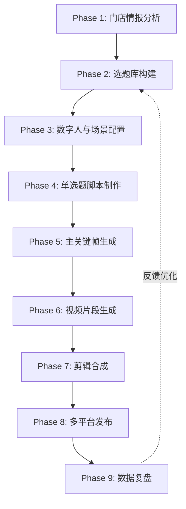
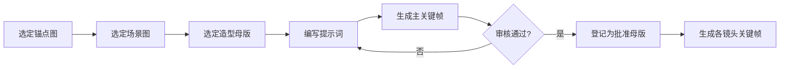

# 眼镜店AI视频制作工作流

> [!abstract] 概述
> 使用AI数字人技术为WLC南京吴良材眼镜店批量制作短视频脚本的完整工作流。从门店情报分析到选题决策、脚本生产、平台适配、物料封装，覆盖从0到1的全流程。

相关文件：[[眼镜店AI视频选题决策工作流-Zcode版]] · [[眼镜店AI视频脚本标准化工作流-Zcode版]] · [[AI视频制作工作流]]

> 本工作流的完整版同时存放在 `WLC眼镜店运营知识库/20_Project/眼镜店AI视频/` 及三个 AI 视频执行仓库中。此处为 Zcode 记忆库归档副本。

---

## 一、工作流总览



| 阶段 | 输入 | 产出 | 耗时 |
|------|------|------|------|
| Phase 1 | 门店信息、行业热点 | 热点简报、爆款公式库 | 1天 |
| Phase 2 | 热点简报、公式库 | 15个选题+周排期表 | 1天 |
| Phase 3 | 数字人锚点、门店场景图 | 锚点配置文件、场景资产清单 | 0.5天 |
| Phase 4 | 选题+锚点+场景 | 单选题AI视频制作包（.md） | 0.5天/选题 |
| Phase 5 | 制作包+锚点图 | 主关键帧+镜头关键帧（.png） | 视镜头数而定 |
| Phase 6 | 关键帧+提示词 | 视频片段（.mp4） | 视镜头数而定 |
| Phase 7 | 视频片段+音频 | 最终成片+字幕+封面 | 1天 |
| Phase 8 | 成片+发布文案 | 多平台发布 | 0.5天 |
| Phase 9 | 发布数据 | 数据复盘报告 | 每周/每月 |

> Phase 1-2 详见 [[眼镜店AI视频选题决策工作流-Zcode版]]，Phase 4 的脚本制作详见 [[眼镜店AI视频脚本标准化工作流-Zcode版]]。本文档重点覆盖 Phase 3、5-9。

---

## 二、Phase 1：门店情报分析（摘要）

### 门店信息

```
- 店铺名称：WLC南京吴良材眼镜店
- 位置：江苏东台市八达城E座
- 电话：13046741390（微信同号）
- 营业时间：08:30-20:30
- 面积：300平大店
- 特色：睿墨咖啡跨界
- 目标受众：东台及周边学生、上班族、家长群体
```

### 三大爆款公式

| 公式 | 结构 | 适用场景 |
|------|------|----------|
| 公式一 | 恐惧钩子+专业拆解+行动清单 | 科普类（离焦镜、防蓝光等） |
| 公式二 | 场景代入+痛点共鸣+解决方案 | 种草类（探店、脸型选框等） |
| 公式三 | 对比冲突+真相揭露+信任建立 | 避坑类（低价配镜、网上配镜等） |

> 详细流程见 [[眼镜店AI视频选题决策工作流-Zcode版]]。

---

## 三、Phase 3：数字人与场景配置

### 3.1 数字人锚点配置

#### 选人原则

| 原则 | 说明 |
|------|------|
| 身份锁定 | 每个数字人有唯一身份锚点图（A01/A02B），所有生成必须传入 |
| 造型分离 | 锚点只锁脸型五官，服装/发型/场景用文字调整 |
| 禁止混脸 | 双人同框时分别传入各自身份锚点，禁止面部互换 |

#### 本项目数字人

| 数字人 | 定位 | 锚点 | 适合场景 |
|--------|------|------|----------|
| 大睿 | 品牌顾问（男） | A01 | 品牌宣传、产品介绍、验光科普 |
| 小墨 | 品牌顾问（女） | A02B | 种草推荐、生活方式、探店 |

#### 造型母版

| 编号 | 造型风格 | 适合内容 |
|------|----------|----------|
| D03 | 品牌顾问正装 | 品牌宣传、专业介绍、避坑类 |
| D04 | 青春潮流休闲 | 学生种草、探店、生活方式 |
| D05 | 未来验光师 | 验光科普、技术展示、新品解析 |

#### 出镜模式选择

| 内容类型 | 出镜模式 | 造型 |
|----------|----------|------|
| 验光科普 | 大睿单人 | D05 |
| 产品种草 | 小墨单人 | D04 |
| 门店探店 | 双人同框 | D04 |
| 避坑/促销 | 双人同框 | D03 |
| 品牌宣传 | 双人同框 | D03 |

### 3.2 场景资产配置

共15张4K门店场景图，分两类：

| 类别 | 编号 | 说明 |
|------|------|------|
| 店内场景 | 01-10 | 轴测总览、环岛、墙柜、验光区、休息区等 |
| 品牌母版 | 11-15 | 入店全景、服务台、外立面（含WLC品牌） |

> [!warning] 白平衡注意
> 场景图生成时注意不要继承偏色，优先使用"无黄色横条"版本，色温控制在5000-5500K中性白。

---

## 四、Phase 4：单选题脚本制作（摘要）

> [!important] 核心阶段
> 每个选题生成一份完整的「AI视频制作包」，包含从创意到发布的全部信息。详细七步法见 [[眼镜店AI视频脚本标准化工作流-Zcode版]]。

### 制作包八大章节

1. **头部信息**：出镜数字人、造型、场景、锚点、画幅、时长、平台
2. **创意简报**：受众、目标、核心信息、情绪弧线、CTA、禁用内容
3. **连续性设定表**：人物、场景、道具、光影、配色、声音
4. **逐镜头分镜表**：每镜头12项设定 + continuity链式衔接
5. **主关键帧生成指令**：PURPOSE/SUBJECT/ACTION/SCENE/CAMERA等
6. **视频生成提示词**：每镜头15项专业影视规范
7. **发布文案与平台适配**：至少2个平台版本
8. **封面设计与特别注意**：道具连续性表、高风险标注

### 镜头数与时长参考

| 视频类型 | 镜头数 | 总时长 | 适用选题 |
|----------|--------|--------|----------|
| 快科普 | 5个 | 约30秒 | #2三指检测法、#10防蓝光、#12镜片选择、#14变色镜片 |
| 标准科普 | 5个 | 约30秒 | #1离焦镜、#3蔡司新品 |
| 避坑类 | 6个 | 约35秒 | #4低价配镜、#5网上配镜、#11暑假避坑 |
| 探店类 | 6个 | 约40秒 | #6探店、#15咖啡跨界 |
| 信任类 | 6个 | 约35秒 | #8成本拆解 |
| 专业类 | 6个 | 约35秒 | #9验光师的一天 |
| 家长科普 | 6个 | 约35秒 | #13第一次配镜 |

---

## 五、Phase 5：主关键帧生成

### 5.1 生成流程



### 5.2 审核清单

主关键帧生成后，逐项检查：

- [ ] 人物身份与锚点一致（脸型、五官比例）
- [ ] 视觉年龄符合设定（28-30岁大睿 / 25-28岁小墨）
- [ ] 服装与造型母版一致
- [ ] 场景与选定场景图一致
- [ ] 白平衡正确（无偏黄/偏绿/偏品红）
- [ ] 手部无畸形
- [ ] 无文字水印或乱码
- [ ] 构图符合机位设定

### 5.3 关键帧生成顺序

1. **主关键帧**（镜头1基准帧）→ 审核通过后冻结为母版
2. **连续性锚点镜头**（如有固定站位的首镜头）
3. **各镜头关键帧**（以主关键帧为参考，只改变动作和景别）
4. **六镜总览图**（并排检查连续性）
5. **相邻镜头对照图**（检查剪辑点连续性）

> [!warning] 批准母版反向锁定
> 用户确认主关键帧后，该图登记为唯一视觉母版并冻结版本。后续所有镜头关键帧必须基于已批准母版生成，不得重新设计人物、服装、发型、场景。

---

## 六、Phase 6：视频片段生成

### 6.1 供应商优先级

| 优先级 | 供应商 | 适用条件 |
|--------|--------|----------|
| 1 | 阿里万相/HappyHorse | 有免费额度时优先 |
| 2 | MiniMax Token Plan | 套餐内额度 |
| 3 | IMA积分 | 备用，需用户批准 |

### 6.2 生成规则

1. 先生成连续性锚点镜头，再生成依赖它的后续镜头
2. 每镜头只描述一个主要动作，降低畸变风险
3. 需要强连续性时，提取上一镜头合格尾帧作为下一镜头首帧
4. 异步调用：提交一次→保存task_id→间隔轮询→成功后立即下载
5. 禁止因等待时间长而重复提交同一镜头

### 6.3 成本记录

每次调用记录：

```
供应商 / 模型ID / 任务ID / 镜头编号 / 提交时间 / 状态 / 分辨率 / 时长 / 权益类型 / 预计费用 / 实际扣费
```

---

## 七、Phase 7：剪辑合成

### 7.1 合成流程

1. **统一技术母版**：帧率30fps、分辨率1080x1920、色彩空间Rec.709
2. **铺设音乐整轨**：一条连续音乐床覆盖全片，片头缓入、片尾渐弱
3. **铺设人声整轨**：同一声音母版、同一语速，禁止拼接各镜头独立生成的人声
4. **移除片段自带音乐**：只保留门铃、脚步等点状环境声
5. **添加字幕**：逐字匹配最终人声，安全区内
6. **调色**：统一白平衡和曝光
7. **响度处理**：人声最高，环境声其次，音乐最低

### 7.2 交付文件清单

| 文件 | 用途 |
|------|------|
| 高质量母版.mp4 | 存档 |
| 平台发布版.mp4 | 各平台上传 |
| 无字幕版.mp4 | 部分平台需要 |
| 字幕文件.srt | 备用 |
| 封面.jpg | 各平台封面 |
| 成本清单.md | API调用台账 |

---

## 八、Phase 8：多平台发布

### 8.1 平台适配要点

| 平台 | 画幅 | 时长 | 首屏要求 | 文案风格 |
|------|------|------|----------|----------|
| 抖音 | 9:16 | 15-40秒 | 前3秒强钩子 | 短平快+话题标签 |
| 小红书 | 9:16或3:4 | 15-30秒 | 封面美感 | emoji+分段+长标签 |
| 朋友圈 | 9:16 | 15-30秒 | 直接利益点 | 精简+地址电话 |
| 视频号 | 9:16 | 30-60秒 | 信息完整 | 深度+转发引导 |

### 8.2 发布文案结构

每条视频至少准备2个平台版本，包含：
- 标题（备选3个）
- 正文（含分段、emoji、CTA）
- 门店信息（地址、电话）
- 话题标签（5-8个）

---

## 九、Phase 9：数据复盘

### 9.1 复盘周期

- **周复盘**：每周一次，检查本周发布内容数据
- **月复盘**：每月一次，分析趋势和优化方向

### 9.2 核心指标

| 指标 | 关注点 |
|------|--------|
| 播放量 | 前3秒完播率（钩子是否有效） |
| 互动率 | 点赞/评论/转发比例 |
| 收藏率 | 小红书种草类重点看 |
| 到店转化 | 私信咨询量、到店提及量 |

### 9.3 优化反馈

数据复盘结果反馈到 Phase 2 选题库，优化下一轮选题决策。

---

## 十、已完成的15个选题脚本

| 序号 | 选题 | 类型 | 出镜 | 造型 | 镜头数 | 时长 |
|------|------|------|------|------|--------|------|
| #1 | 离焦镜白戴了？镜片下滑1mm防控效果打对折 | 科普 | 大睿单人 | D05 | 5 | 30秒 |
| #2 | 三指检测法：在家自查孩子眼镜位置 | 科普 | 大睿单人 | D05 | 5 | 30秒 |
| #3 | 蔡司小瞳堡新品解析 | 种草 | 大睿单人 | D05 | 5 | 30秒 |
| #4 | 3块8配的近视镜和3000块的有啥区别？ | 避坑 | 双人同框 | D03 | 6 | 35秒 |
| #5 | 为什么我不建议你在网上配眼镜 | 避坑 | 双人同框 | D03 | 6 | 35秒 |
| #6 | 300平大店探店 | 探店 | 双人同框 | D04 | 6 | 40秒 |
| #7 | 不同脸型怎么选镜框 | 种草 | 小墨单人 | D04 | 5 | 30秒 |
| #8 | 配镜成本拆解 | 信任 | 大睿单人 | D03 | 6 | 35秒 |
| #9 | 验光师的一天 | 专业 | 大睿单人 | D05 | 6 | 35秒 |
| #10 | 防蓝光眼镜有没有用 | 科普 | 大睿单人 | D05 | 5 | 30秒 |
| #11 | 暑假配镜避坑指南 | 促销 | 双人同框 | D03 | 6 | 35秒 |
| #12 | 明月1.71 vs 1.74 | 科普 | 大睿单人 | D05 | 5 | 30秒 |
| #13 | 孩子第一次配镜5件事 | 科普 | 大睿单人 | D05 | 6 | 35秒 |
| #14 | 变色镜片夏日种草 | 种草 | 小墨单人 | D04 | 5 | 30秒 |
| #15 | 睿墨咖啡×眼镜店 | 探店 | 小墨单人 | D04 | 5 | 30秒 |

---

## 十一、质量检查清单

> [!success] 脚本交付前必检

### 11.1 文件命名
- [ ] 文件名序号与选题库一致（选题XX_标题_AI视频制作包.md）
- [ ] 序号在README索引中按1-15顺序排列

### 11.2 头部信息
- [ ] 出镜数字人、造型、场景、锚点、画幅、时长、平台均填写完整
- [ ] 造型选择与内容类型匹配（科普→D05，种草→D04，避坑→D03）

### 11.3 创意简报
- [ ] 目标受众含年龄段
- [ ] 核心信息一句话说清
- [ ] 情绪弧线有起点和终点
- [ ] 禁用内容字段已填写

### 11.4 连续性设定
- [ ] 人物设定含锚点编号、年龄、服装、是否戴眼镜
- [ ] 光影设定含色温、主光方向、辅光比
- [ ] 双人脚本含站位说明（大睿左/小墨右）

### 11.5 分镜表
- [ ] 每镜头含景别、机位、焦段、距离、运镜、表演、动作
- [ ] 每镜头含 continuity_in 和 continuity_out
- [ ] 旁白字数与镜头时长匹配（约3.5字/秒）
- [ ] 每镜头只安排一个主要动作

### 11.6 关键帧与视频提示词
- [ ] 含PURPOSE/SUBJECT/ACTION/SCENE/CAMERA/LIGHTING/COLOR/ASPECT_RATIO/NEGATIVE
- [ ] 视频提示词含完整15项专业规范
- [ ] 双人脚本含镜头关键帧生成顺序表

### 11.7 发布文案
- [ ] 至少2个平台版本
- [ ] 含门店信息（地址、电话）
- [ ] 含5-8个话题标签
- [ ] 无禁用词

---

> [!quote] 工作流核心原则
> 1. **序号一致**：选题库→文件名→README索引，序号1-15严格对应，不可跳号
> 2. **身份锁定**：每镜必传身份锚点，不依赖模型自行延续身份
> 3. **连续性链式**：镜头间通过 continuity_in/out 链式衔接，不依赖剪辑补因果
> 4. **单镜头单动作**：降低AI生成畸变风险
> 5. **合规先行**：禁用内容字段必填，红线词不进脚本
> 6. **先审后生**：主关键帧审核通过后才能提交视频任务，避免无效计费

## 关联

- [[眼镜店AI视频选题决策工作流-Zcode版]]（上游：热点→选题三层漏斗）
- [[眼镜店AI视频脚本标准化工作流-Zcode版]]（中间：选题→制作包七步法）
- [[AI视频制作工作流]]（通用AI视频工作流）
- [[../00_HOME/Zcode启动必读]]
