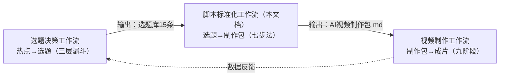
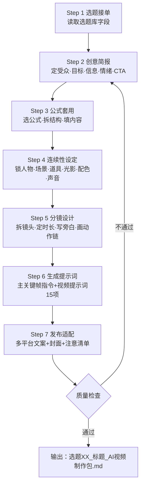

# 眼镜店AI视频脚本标准化工作流

> [!abstract] 概述
> 从**选题确定**到**规范脚本产出**的完整操作流程。选题决策工作流解决"做什么"，视频制作工作流解决"全流程管什么"，本文档解决中间最关键的一环：**一个确定好的选题，如何一步步变成一份规范的AI视频制作包**。

相关文件：[[眼镜店AI视频选题决策工作流-Zcode版]] · [[眼镜店AI视频制作工作流-Zcode版]] · [[AI视频制作工作流]]

> 本工作流的完整版同时存放在 `WLC眼镜店运营知识库/20_Project/眼镜店AI视频/` 及三个 AI 视频执行仓库中。此处为 Zcode 记忆库归档副本。

---

## 一、定位：三份工作流的关系



| 工作流 | 输入 | 输出 | 核心问题 |
|--------|------|------|----------|
| 选题决策工作流 | 行业热点+爆款公式+门店优势 | 选题库（15条选题+排期） | 做什么内容？ |
| **脚本标准化工作流（本文档）** | **选题库中的1条选题** | **AI视频制作包（.md）** | **怎么把选题写成规范脚本？** |
| 视频制作工作流 | AI视频制作包 | 最终成片视频 | 怎么把脚本变成视频？ |

---

## 二、七步法总览



| 步骤 | 输入 | 产出 | 耗时 | 关卡 |
|------|------|------|------|------|
| Step 1 | 选题库1条选题 | 选题接单单 | 5分钟 | — |
| Step 2 | 选题接单单 | 创意简报表 | 15分钟 | 关卡1：简报审核 |
| Step 3 | 创意简报+爆款公式 | 内容结构骨架 | 10分钟 | — |
| Step 4 | 结构骨架+数字人配置+场景清单 | 连续性设定表 | 20分钟 | — |
| Step 5 | 连续性设定表+结构骨架 | 逐镜头分镜表 | 30分钟 | 关卡2：分镜审核 |
| Step 6 | 分镜表+锚点配置 | 关键帧指令+视频提示词 | 25分钟 | — |
| Step 7 | 分镜表+门店信息 | 发布文案+封面+注意清单 | 15分钟 | 关卡3：交付审核 |

> [!tip] 总耗时
> 单条选题从接单到交付，约2小时。熟练后可压缩至1.5小时。

---

## 三、Step 1：选题接单

### 3.1 读取字段

从选题库中读取该选题的以下字段：

| 字段 | 用途 | 示例（选题#1） |
|------|------|----------------|
| 序号 | 文件命名 | #1 |
| 选题标题 | 脚本标题 | 离焦镜白戴了？镜片下滑1mm防控效果打对折 |
| 类型 | 决定公式和出镜模式 | 科普 |
| 钩子 | 前3秒话术来源 | "花上万块配的离焦镜，可能只发挥了30%的作用" |
| 对应公式 | 内容结构骨架 | 公式一 |
| 戳中需求 | 创意简报输入 | 家长恐惧钱白花+孩子度数控制不住 |
| 优先级 | 排期参考 | ★★★★★ |

### 3.2 自动决策项

根据选题类型，自动确定以下配置：

| 选题类型 | 出镜模式 | 造型母版 | 场景偏好 | 典型时长 |
|----------|----------|----------|----------|----------|
| 验光科普 | 大睿单人 | D05未来验光师 | 05验光设备区/08 3D验光区 | 30-35秒 |
| 产品种草 | 小墨单人 | D04青春潮流 | 09产品柜台/07隐形专区 | 30秒 |
| 配镜避坑 | 双人同框 | D03品牌顾问 | 12服务台/09产品柜台 | 35秒 |
| 门店探店 | 双人同框 | D04青春潮流 | 01轴测总览/11入店全景 | 40秒 |
| 信任/成本 | 大睿单人 | D03品牌顾问 | 12服务台/05验光设备区 | 35秒 |
| 跨界/生活方式 | 小墨单人 | D04青春潮流 | 06休息区/睿墨咖啡角 | 30秒 |

---

## 四、Step 2：创意简报

### 4.1 简报模板

```markdown
## 一、创意简报

| 项目 | 内容 |
|------|------|
| 目标受众 | [人群]+[年龄段]+[地域/场景] |
| 传播目标 | 这条视频要达成的具体效果 |
| 核心信息 | 一句话核心卖点（不超过20字） |
| 情绪弧线 | 起点→中段→终点（3-4个情绪节点） |
| 核心CTA | 引导用户做的具体动作 |
| 禁用内容 | 眼镜行业合规红线词 |
| 验收人 | 用户（店主） |
```

### 4.2 情绪弧线设计参考

| 选题类型 | 推荐情绪弧线 | 公式对应 |
|----------|-------------|----------|
| 验光科普 | 震惊→焦虑→理解→行动 | 公式一 |
| 配镜避坑 | 好奇→震惊→恐惧→信任→理性 | 公式三 |
| 产品种草 | 痛点→好奇→惊喜→想要 | 公式二 |
| 门店探店 | 好奇→惊艳→信任→行动 | 公式二 |
| 信任/成本 | 好奇→认同→信任→行动 | 公式三 |

> [!danger] 合规红线词库
> 以下词汇在所有脚本中**绝对禁用**：
> - 医疗承诺类：治疗近视、恢复视力、降低度数、保证不涨度数、治愈近视
> - 绝对化类：100%有效、全网最低、最便宜、最好的、第一
> - 夸大类：根治、彻底、永久、零风险、无副作用

### 4.3 关卡1：简报审核

- [ ] 目标受众含年龄段和具体场景
- [ ] 核心信息一句话可读完
- [ ] 情绪弧线有3个以上节点
- [ ] CTA是具体可执行的动作
- [ ] 禁用内容已列明
- [ ] 与选题库中的"戳中需求"一致

---

## 五、Step 3：公式套用

### 5.1 公式一：恐惧钩子+专业拆解+行动清单

适用于：验光科普、新品解析、技术科普

| 结构环节 | 时长 | 写什么 | 选题#1示例 |
|----------|------|--------|-----------|
| 钩子 | 3秒 | 反直觉恐惧结论 | "花上万配的离焦镜，可能只发挥了30%的作用" |
| 专业拆解 | 7秒 | 引用共识/数据 | "2026新共识：偏1mm，防控效果打对折" |
| 通俗翻译 | 8秒 | 比喻讲清原理 | "离焦镜是狙击枪，镜片滑了=瞄准歪了" |
| 行动清单 | 7秒 | 3步自查方法 | "三指检测法：看、量、查" |
| CTA引导 | 4秒 | 到店+关注 | "带孩子来免费检查镜片位置" |

### 5.2 公式二：对比表格+平台差异+策略结论

适用于：脸型选框、产品评测、探店展示

| 结构环节 | 时长 | 写什么 |
|----------|------|--------|
| 钩子 | 3秒 | 反直觉结论 |
| 深度分析 | 8秒 | 底层逻辑解释 |
| 对比展示 | 10秒 | 多维度对比（表格/实物） |
| 策略结论 | 7秒 | 明确建议 |
| CTA引导 | 4秒 | 到店+互动 |

### 5.3 公式三：价格冲击+成本拆解+价值重建

适用于：配镜避坑、价格透明、网上配镜

| 结构环节 | 时长 | 写什么 |
|----------|------|--------|
| 钩子 | 3秒 | 极端价格冲击 |
| 现象展示 | 5秒 | 列举低价渠道 |
| 成本拆解 | 8秒 | 为什么这么便宜 |
| 风险揭示 | 7秒 | 代价是什么 |
| 价值重建 | 7秒 | 专业配镜三位一体 |
| CTA引导 | 4秒 | 到店+互动 |

### 5.4 镜头数与时长推算

| 公式 | 结构环节 | 镜头数 | 总时长 |
|------|----------|--------|--------|
| 公式一 | 5环节 | 5-6个 | 30-35秒 |
| 公式二 | 5环节 | 5-6个 | 30-35秒 |
| 公式三 | 6环节 | 6个 | 35-40秒 |

> [!tip] 时长分配原则
> - 钩子≤3秒（前3秒决定完播率）
> - 每个内容环节5-8秒（太短说不清，太长没人看）
> - CTA 3-5秒（收尾要快，别拖）
> - 总时长控制在30-40秒（抖音黄金时长）

---

## 六、Step 4：连续性设定

### 6.1 六维度锁定

#### 人物设定

| 项目 | 设定 |
|------|------|
| 身份锚点 | A01（大睿）/ A02B（小墨）/ A01+A02B（双人） |
| 视觉年龄 | 大睿28-30岁 / 小墨25-28岁，年轻健康 |
| 发型 | 具体描述（颜色、长短、是否遮额头） |
| 眼镜 | 大睿不戴眼镜（验光师角色）/ 小墨可选装饰镜 |
| 服装 | 造型编号+具体描述（颜色、材质、搭配） |

> [!warning] 锚点使用规则
> - 身份锚点是每镜必须传入的最高优先级参考图
> - 锚点只锁脸型五官，不锁年龄/皮肤/服装（这些用文字控制）
> - 双人同框时各传入各自身份锚点，禁止面部互换

#### 场景设定

| 项目 | 设定 |
|------|------|
| 主场景 | 场景编号+描述（如：05验光设备区） |
| 空间结构 | 人物站位、设备位置、前后景关系 |
| 核心道具 | 1-3件关键道具，需注明颜色材质 |

#### 光影设定

| 项目 | 设定 |
|------|------|
| 主光来源 | 光源类型+方向+色温（如：顶部柔光灯箱，5500K） |
| 辅光 | 方向+光比（如：左侧45度，2:1） |
| 轮廓光 | 方向+用途（如：右后方，分离人物与背景） |

> [!warning] 白平衡锁定
> 全片色温锁定在5000-5500K中性白。禁止偏黄色调冒充"温馨感"。

#### 配色设定

| 项目 | 设定 |
|------|------|
| 主色 | 服装色+墙面色（如：深蓝+白） |
| 辅色 | 设备/家具色（如：银灰） |
| 点缀色 | 环境光源色（如：蓝绿指示灯） |
| 色温 | 5500K中性白 |

#### 声音设定

| 项目 | 设定 |
|------|------|
| 人声 | 大睿/小墨声音母版（统一音色、语速、情绪） |
| 语速 | 中等偏快约3.5-4字/秒 |
| BGM | 风格描述（如：轻科技感，低音量不盖人声） |
| 字幕 | 白底黑字或黑底白字，画面中下方安全区 |

### 6.2 双人同框特殊规则

双人脚本在连续性设定中需额外增加：

| 维度 | 额外内容 |
|------|----------|
| 人物设定 | 分大睿/小墨两列，各自独立描述 |
| 站位说明 | 大睿在画面左侧，小墨在画面右侧（全片锁定） |
| 旁白分配 | 哪些镜头谁说话，是否交替对话 |
| 身份隔离 | 提示词中声明"两图面部各自独立，禁止混合" |

---

## 七、Step 5：分镜设计

### 7.1 镜头拆分原则

| 原则 | 说明 |
|------|------|
| 一个结构环节 = 一个镜头 | 公式骨架的每个环节对应一个镜头 |
| 特殊情况可拆 | 如果某个环节内容太多（>10秒），可拆为2个镜头 |
| 总镜头数控制 | 5-6个为最佳，不超过7个 |
| 钩子单独成镜 | 前3秒钩子必须是独立镜头，不可与其他内容合并 |

### 7.2 单镜头设定表模板（12项）

```markdown
### 镜头X：功能名称（起秒-止秒）

**叙事功能：** 这个镜头在整片中的作用
**情绪目标：** 该镜头要传递的情绪

| 项目 | 设定 |
|------|------|
| 景别 | 近景/中近景/中景（注明身体截取线） |
| 机位高度 | 与眼睛平齐/与胸部平齐/略高俯角X度 |
| 相机方位 | 正面/正面偏左X度 |
| 焦段 | 35mm/50mm等效 |
| 相机距离 | 1.0米/1.2米/1.5米 |
| 运镜方式 | 固定机位/极缓慢推进dolly in/极缓慢横移slider |
| 构图 | 主体位置+留白方向+前后景 |
| 表演 | 具体表情+肢体动作（可执行级别描述） |
| 唯一主要动作 | 每镜只安排一个主要动作 |
| continuity_in | 承接上一镜头的结束状态 |
| continuity_out | 本镜头结束状态（留给下一镜头承接） |
| transition_to_next | 硬切/叠化/动作匹配 |

**旁白：** "具体旁白文字"
**字幕：** 画面字幕内容（精简版，非旁白全文）
```

### 7.3 连续性链式衔接

> [!important] 链式衔接铁律
> - 下一镜头的 `continuity_in` 必须等于上一镜头的 `continuity_out`
> - 如果动作不连贯，必须增加过渡镜头或调整动作设计
> - 全片的动作链必须从镜1到镜N无断裂

### 7.4 旁白写作规则

```
旁白字数 ≈ 镜头秒数 × 3.5字/秒（中等偏快语速）
```

| 镜头时长 | 旁白字数范围 | 示例 |
|----------|-------------|------|
| 3秒 | 10-12字 | "你花上万配的离焦镜，可能白戴了" |
| 5秒 | 17-18字 | "2026新共识：偏1mm，防控效果打对折" |
| 7秒 | 24-25字 | "离焦镜有上万个微透镜，镜片一滑就错位，等于白戴" |
| 8秒 | 28-30字 | "打个比方，离焦镜是狙击枪，验配是瞄准，佩戴是扣扳机" |

### 7.5 动作设计规则

| 规则 | 说明 | 原因 |
|------|------|------|
| 单镜头单动作 | 每镜头只安排一个主要动作 | 降低AI生成畸变风险 |
| 动作可执行 | 描述要具体到肢体部位和方向 | 模型需要明确指令 |
| 动作有起止 | 起势→执行→落点→余韵 | 避免动作突然开始/停止 |
| 禁止复杂手势 | 避免5指独立运动、精细操作 | AI手部生成高风险 |

> [!warning] 高风险动作清单
> - 手指精细操作（比划具体距离、转动小物件）
> - 持物展示（镜片、杯子等易穿模）
> - 多人互动（递接物品、并排行走）
> - 走动/转身（空间一致性容易断裂）
> - 接近镜面/玻璃（反射容易出错）

### 7.6 关卡2：分镜审核

- [ ] 镜头数5-6个，总时长30-40秒
- [ ] 每镜头含完整12项设定
- [ ] 所有镜头的 continuity_in/out 链式衔接无断裂
- [ ] 每镜头只有一个主要动作
- [ ] 旁白字数与镜头时长匹配（3.5字/秒）
- [ ] 字幕是旁白精简版，每行≤10字
- [ ] 前3秒钩子有冲击力
- [ ] CTA镜头含门店信息
- [ ] 无禁用词

---

## 八、Step 6：生成提示词

### 8.1 主关键帧指令

```markdown
## 四、主关键帧生成指令

### 4.1 主关键帧（镜头1基准帧）

**生成工具：** OpenRouter google/gemini-3-pro-image（Nano Banana Pro）
**参考图：** 身份锚点图（第一参考图，最高优先级）
**画幅：** 9:16竖屏
**分辨率：** 2K（先审核，通过后再做4K版）

[PURPOSE]: AI数字人视频主关键帧——[场景描述]
[SUBJECT]: [人物详细描述——性别、年龄、发型、服装、锚点编号、表情]
[ACTION]: [人物具体动作和姿态]
[SCENE]: [场景详细描述——空间、家具、设备、氛围]
[CAMERA]: [景别、机位、焦段、距离]
[LIGHTING]: [主光、辅光、轮廓光、色温]
[COLOR]: [主色+辅色+点缀色，色温]
[STYLE]: 真实感摄影风格，非卡通非插画
[ASPECT_RATIO]: 9:16竖屏
[NEGATIVE_CONSTRAINTS]:
- 禁止面部与锚点不一致
- 禁止文字、Logo、水印出现在画面中
- 禁止过度磨皮、塑料感
- 禁止偏黄色调
- 禁止手指畸形、手部穿模
```

### 8.2 视频生成提示词（15项专业规范）

每个镜头一份完整的视频生成提示词，必须包含以下15项：

```markdown
### 镜头X生成提示词（起秒-止秒）

[镜头X/N · 功能名 · X秒]

1.制作目标：[镜头叙事功能和情绪目标]
2.连续性承接：continuity_in / continuity_out
3.场景美术：[空间结构、陈设、材质、核心道具]
4.人物造型：[锚点编号、年龄、服装、发型、眼镜、妆容]
5.表演与调度：[情绪、视线、站位、移动路径、姿态、唯一主要动作]
6.摄影设计：[景别、机位高度、相机方位、焦段、距离、运镜方式]
7.叙事视角：[客观观察/人物主观/道具视角]
8.构图与焦点：[主体位置、前中后景、留白、焦点转移]
9.灯光与配色：[光源、主辅光比、色温、主辅点缀色、对比度]
10.节奏：[镜头时长、动作节拍——起势X秒→执行X秒→落点X秒]
11.声音设计：[旁白文字、语速、语气、BGM、环境声]
12.转场设计：[硬切/叠化/动作匹配，依据]
13.技术规格：[9:16竖屏、720P/1080P、X秒、30fps、H.264、无水印]
14.锁定与反向约束：[身份/服装/场景锁定项+禁止项]
15.现实逻辑：[人物与物体接触关系、重力、物理常识]
```

---

## 九、Step 7：发布适配

### 9.1 平台文案矩阵

每个选题至少提供2个平台版本：

| 平台 | 文案风格 | 字数 | emoji | 话题标签 |
|------|----------|------|-------|----------|
| 抖音 | 短平快+钩子+CTA | 100-150字 | 少量 | 5-8个 |
| 小红书 | 分段+emoji+干货+种草 | 200-300字 | 多 | 8-10个 |
| 朋友圈 | 精简+利益点+地址电话 | 50-80字 | 1-2个 | 无 |
| 公众号 | 深度+专业+信任 | 500字+ | 少 | 3-5个 |

### 9.2 关卡3：交付审核

脚本文件交付前，逐项检查：

- [ ] 文件命名规范：`选题XX_标题_AI视频制作包.md`
- [ ] 头部信息完整（出镜、造型、场景、锚点、画幅、时长、平台）
- [ ] 八大章节齐全（头部信息→简报→连续性→分镜→关键帧→视频提示词→发布文案→注意清单）
- [ ] 禁用词零出现
- [ ] 旁白字数与时长匹配
- [ ] continuity链式无断裂
- [ ] 至少2个平台发布文案
- [ ] 道具连续性表已填写
- [ ] 高风险镜头已标注

---

## 十、完整实例：选题#1全流程推演

### Step 1 选题接单

```
选题#1：离焦镜白戴了？镜片下滑1mm防控效果打对折
类型：验光科普 → 大睿单人 / D05 / 05验光设备区
公式：公式一
源头热点：2026近视防控共识 ★★★★★
```

### Step 2 创意简报

| 项目 | 内容 |
|------|------|
| 目标受众 | 东台及周边配了离焦镜的孩子家长（30-45岁） |
| 核心信息 | 离焦镜片下滑1mm，防控效果打对折 |
| 情绪弧线 | 震惊→焦虑→理解→行动 |
| 核心CTA | 带孩子来WLC免费检查镜片位置 |
| 禁用内容 | 治疗近视、恢复视力、保证不涨度数、100%有效 |

### Step 3 公式套用

| 结构环节 | 时长 | 内容 |
|----------|------|------|
| 钩子 | 3秒 | "花上万配的离焦镜，可能只发挥30%作用" |
| 专业拆解 | 7秒 | "2026新共识：偏1mm，防控效果打对折" |
| 通俗翻译 | 8秒 | "离焦镜是狙击枪，镜片滑了=瞄准歪了" |
| 行动清单 | 7秒 | "三指检测法：看、量、查" |
| CTA引导 | 4秒 | "带孩子来免费检查" |

→ "通俗翻译"内容丰富拆为2个镜头 → **6个镜头，35秒**

### Step 5 分镜设计（摘要）

| 镜头 | 时长 | 功能 | 主要动作 | continuity_out |
|------|------|------|----------|----------------|
| 镜1 | 3秒 | 钩子 | 举镜片展示 | 右手持镜片举至胸前 |
| 镜2 | 7秒 | 专业拆解 | 转动镜片展示纹理 | 双手持镜片举至眼前 |
| 镜3 | 8秒 | 原理讲解 | 比划距离+指向设备 | 右手下垂左手搭设备 |
| 镜4 | 7秒 | 三指检测 | 食指放脸侧比划 | 右手食指竖起放脸侧 |
| 镜5 | 6秒 | 行动清单 | 逐个竖起三指 | 右手三指竖起放胸前 |
| 镜6 | 4秒 | CTA引导 | 微笑+引导手势 | 右手伸出做引导手势 |

---

> [!quote] 脚本标准化核心原则
> 1. **先锁后写**：连续性设定表没完成，不写分镜
> 2. **链式衔接**：每镜头的 continuity_in/out 必须首尾相接
> 3. **单镜单动作**：降低AI生成畸变风险
> 4. **字数匹配**：旁白字数与镜头时长严格匹配（3.5字/秒）
> 5. **合规先行**：禁用词零容忍
> 6. **三关把控**：简报审核→分镜审核→交付审核，前一关不过不进下一关

## 关联

- [[眼镜店AI视频选题决策工作流-Zcode版]]（上游：热点→选题三层漏斗）
- [[眼镜店AI视频制作工作流-Zcode版]]（下游：制作包→成片九阶段）
- [[AI视频制作工作流]]（通用AI视频工作流）
- [[../00_HOME/Zcode启动必读]]
