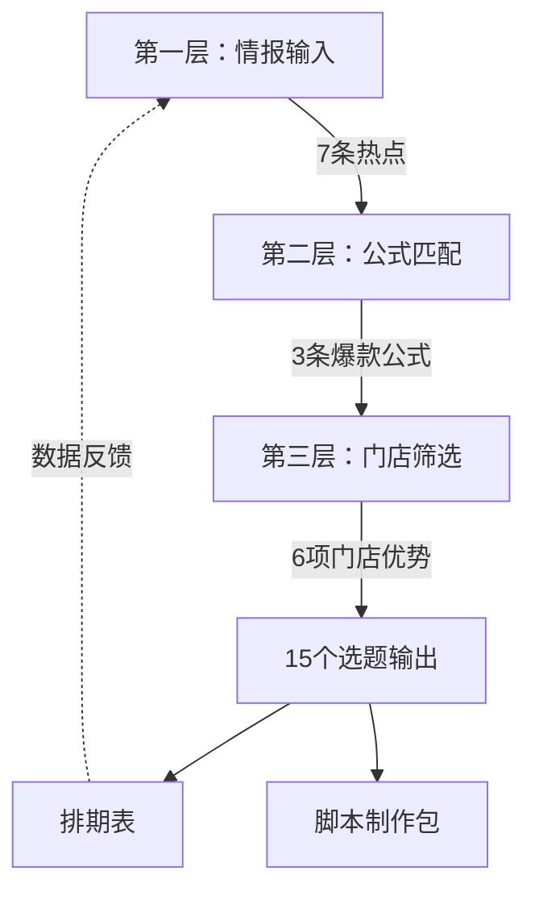
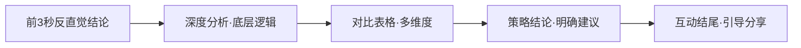
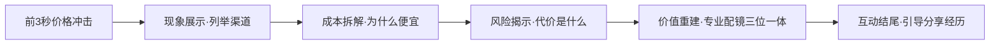

# 眼镜店AI视频选题决策工作流

> [!abstract] 概述
> WLC南京吴良材眼镜店AI视频脚本选题的完整决策流程。选题不是凭感觉拍脑袋，而是通过"情报输入 → 公式匹配 → 门店筛选"三层漏斗，确保每个选题有据可依、有公式可套、有门店优势可借。

相关文件：[[眼镜店AI视频制作工作流-Zcode版]] · [[眼镜店AI视频脚本标准化工作流-Zcode版]] · [[AI视频制作工作流]]

> 本工作流的完整版同时存放在 `WLC眼镜店运营知识库/20_Project/眼镜店AI视频/` 及三个 AI 视频执行仓库（眼镜店/王子墨/王子睿）中。此处为 Zcode 记忆库归档副本，便于跨项目参考。

---

## 一、选题决策总览



| 层级 | 输入 | 处理逻辑 | 产出 |
|------|------|----------|------|
| 第一层 | 行业热点、平台趋势 | 抓取→筛选→标注行动点 | 7条热点简报 |
| 第二层 | 热点简报 | 热点×公式交叉匹配 | 选题方向+内容角度 |
| 第三层 | 选题方向 | 门店优势×受众需求筛选 | 15个具体选题 |

---

## 二、第一层：情报输入

### 2.1 情报来源

| 来源类型 | 具体渠道 | 抓取频率 |
|----------|----------|----------|
| 行业媒体 | 今日头条眼镜频道、搜狐时尚 | 每日 |
| 消费平台 | 什么值得买、小红书热门笔记 | 每日 |
| 行业报告 | 眼镜行业消费白皮书、近视防控共识 | 每月/季度 |
| 竞品动态 | 抖音/小红书同城眼镜账号 | 每周 |
| 平台趋势 | 抖音热门话题、小红书热搜词 | 每日 |

### 2.2 热点简报模板

每条热点必须包含以下字段：

```markdown
### N. 热点标题
**摘要：** 一句话说清热点内容（含关键数据）
**来源：** [平台·作者](链接)
**WLC行动点：** ★~★★★★★ + 具体可执行的内容方向
```

### 2.3 热点筛选标准

一条热点要进入选题漏斗，必须同时满足：

| 标准 | 说明 | 不满足则 |
|------|------|----------|
| 相关性 | 与眼镜零售、近视防控、配镜消费直接相关 | 丢弃 |
| 时效性 | 近3天内的新热点，或持续发酵的趋势 | 降级为储备 |
| 可操作性 | WLC门店能产出对应内容（有场景、有产品、有专业能力） | 丢弃 |
| 行动点明确 | 能写出具体的"做什么内容" | 暂缓 |

### 2.4 热点分级

| 级别 | 标准 | 处理方式 |
|------|------|----------|
| ★★★★★ | 行业重大共识/政策/新品 + 东台本地有需求 | 立即做选题，本周首发 |
| ★★★★ | 行业趋势/消费洞察 + WLC有差异化优势 | 本周做选题，排入排期 |
| ★★★ | 有价值但不紧急 | 储备选题库，择机排期 |
| ★★以下 | 相关性弱或不可操作 | 丢弃 |

### 2.5 产出文件

```
20_Project/内容运营流水线/01_热点简报/YYYY-MM-DD_眼镜行业热点简报.md
```

> [!example] 实际案例
> 2026-07-28热点简报抓取了7条热点，其中"2026近视防控共识：镜片下滑1mm效果打对折"评为★★★★★，直接催生了选题#1和#2。

---

## 三、第二层：爆款公式匹配

### 3.1 三大爆款公式

每条通过筛选的热点，必须匹配到一条爆款公式，确定内容角度和结构骨架。

#### 公式一：恐惧钩子 + 专业拆解 + 行动清单


| 要素 | 写法 | 眼镜店示例 |
|------|------|-----------|
| 恐惧钩子 | 反直觉的恐惧性结论 | "花上万配的离焦镜，可能只发挥了30%的作用" |
| 专业拆解 | 引用共识/白皮书/临床数据 | "2026新共识：镜片偏离1mm，防控效果打对折" |
| 通俗翻译 | 用比喻讲清楚 | "离焦镜是狙击枪，验配是瞄准，佩戴是扣扳机" |
| 行动清单 | 可操作的自我检测 | "三指检测法：看、量、查" |
| 互动结尾 | 引导用户参与 | "评论区晒晒你家镜架照片，帮你看看位置" |

**适用选题类型：** 近视防控、验光科普、配镜避坑
**情绪触发：** 恐惧（钱白花了）→ 焦虑（度数控制不住）→ 安心（有方法自查）

#### 公式二：对比表格 + 平台差异 + 策略结论



| 要素 | 写法 | 眼镜店示例 |
|------|------|-----------|
| 反直觉结论 | 打破常识的判断 | "圆脸方脸长脸，选对镜框换张脸" |
| 深度分析 | 从底层逻辑解释 | 脸型×镜框形状的匹配原理 |
| 对比表格 | 多维度直观对比 | 圆脸/方脸/长脸 × 适合镜框 6维度对比 |
| 策略结论 | 给出明确建议 | "圆脸选方框，方脸选圆框" |
| 互动结尾 | 引导用户参与 | "你是什么脸型？评论区告诉你适合什么框" |

**适用选题类型：** 种草推荐、探店展示、穿搭搭配
**情绪触发：** 认知刷新 → 安全感（有明确方向）→ 行动力

#### 公式三：价格冲击 + 成本拆解 + 价值重建



| 要素 | 写法 | 眼镜店示例 |
|------|------|-----------|
| 价格冲击 | 极端价格制造冲击 | "3块8在抖音配近视镜" |
| 现象展示 | 列举低价渠道和价格 | 抖音3.81元、淘宝9.9元 |
| 成本拆解 | 分析为什么这么便宜 | 材料替代、省掉验光、无售后 |
| 风险揭示 | 讲清楚代价 | 验光不准、镜片劣质、无调校 |
| 价值重建 | 重建专业配镜认知 | "专业验光+正品镜片+售后调校"三位一体 |
| 互动结尾 | 引导用户参与 | "你有没有在网上配过眼镜？体验怎么样？" |

**适用选题类型：** 配镜避坑、价格透明化、线上线下对比
**情绪触发：** 震惊（这么便宜？）→ 恐惧（会不会伤眼睛）→ 信任（这家店说真话）

### 3.2 热点×公式匹配表

每条热点匹配公式时，按以下逻辑判断：

| 热点类型 | 首选公式 | 判断依据 |
|----------|----------|----------|
| 近视防控新共识/新研究 | 公式一 | 有数据背书+家长恐惧+可自查 |
| 新品发布/技术升级 | 公式一 | 有技术亮点+可专业拆解 |
| 低价配镜/行业乱象 | 公式三 | 有价格冲击+可拆成本+可重建价值 |
| 消费白皮书/行业报告 | 公式三 | 有数据支撑+可拆解+可建信任 |
| 平台趋势/运营策略 | 公式二 | 有对比维度+可列表+可给建议 |
| 产品评测/选品指南 | 公式二 | 有对比维度+可表格+可种草 |
| 门店特色/探店体验 | 公式二 | 有场景代入+可展示+可种草 |

### 3.3 匹配产出

每条热点匹配公式后，输出一个"选题方向"：

```
热点：2026近视防控共识（★★★★★）
匹配公式：公式一（恐惧钩子+专业拆解+行动清单）
选题方向：教家长自查离焦镜佩戴位置
```

> [!tip] 一个热点可衍生多个选题
> 同一热点可以从不同角度切入，衍生多个选题。如"近视防控共识"衍生出#1（恐惧钩子版）和#2（行动清单版），"低价配镜"衍生出#4（价格对比版）和#5（风险揭示版）。

---

## 四、第三层：门店筛选

### 4.1 门店优势盘点

热点和公式确定大方向后，必须经过门店优势筛选，确保选题能落地。

#### WLC门店优势清单

| 优势项 | 具体描述 | 可衍生的选题方向 |
|--------|----------|-----------------|
| 300平大店 | 东台罕见的大面积眼镜店，有空间展示 | 探店类、验光流程展示、空间感种草 |
| 睿墨咖啡跨界 | 配镜等咖啡的独特体验，本地独有 | 跨界探店、生活方式种草 |
| 15年经验验光师 | 专业背书，信任度高 | 验光科普、专业展示、家长信任 |
| 吴良材品牌 | 老字号品牌认知度 | 品牌信任、专业形象 |
| 东台本地位置 | 八达城E座，本地流量 | 本地探店、导航到店、同城引流 |
| 暑假配镜高峰 | 季节性需求爆发 | 促销活动、避坑指南、学生配镜 |

#### 门店优势筛选规则

| 规则 | 说明 |
|------|------|
| 优势匹配 | 选题必须能借力至少1项门店优势 |
| 场景可拍 | 选题对应的场景在门店15张场景图中有覆盖 |
| 产品可展 | 选题涉及的产品/道具门店有现货可展示 |
| 人设可出 | 选题适合大睿（专业科普）或小墨（种草推荐）的人设 |

### 4.2 受众需求矩阵

结合WLC目标受众，按人群×需求筛选选题：

| 受众群体 | 核心需求 | 选题方向 | 对应选题 |
|----------|----------|----------|----------|
| 家长（30-45岁） | 孩子近视防控 | 离焦镜科普+自查方法+新品解析 | #1 #2 #3 #13 |
| 价格敏感消费者 | 配镜不踩坑 | 低价配镜避坑+成本透明+网上配镜风险 | #4 #5 #8 #11 |
| 上班族（20-35岁） | 护眼+美观 | 防蓝光科普+脸型选框+变色镜片 | #7 #10 #14 |
| 学生（15-25岁） | 颜值+性价比 | 脸型选框+镜片选择+探店 | #6 #7 #12 |
| 本地用户 | 找靠谱门店 | 探店+验光师展示+咖啡跨界 | #6 #9 #15 |

### 4.3 选题优先级评分

每个选题按5个维度评分，总分决定优先级：

| 维度 | 评分标准（1-5分） |
|------|-------------------|
| 热点相关度 | 是否对接当下热点（5=★★★★★热点） |
| 门店优势度 | 能否借力门店差异化优势（5=独家优势） |
| 受众需求度 | 目标受众需求强度（5=刚需高频） |
| 制作可行性 | AI数字人能否呈现（5=低风险易生成） |
| 转化潜力度 | 能否直接引导到店（5=强CTA） |

> [!example] 评分示例
> 选题#1「离焦镜白戴了」：热点5 + 门店4 + 受众5 + 制作4 + 转化5 = **24分** → ★★★★★
>
> 选题#12「明月1.71 vs 1.74」：热点3 + 门店3 + 受众3 + 制作4 + 转化3 = **16分** → ★★★

### 4.4 优先级分级

| 总分 | 优先级 | 处理方式 |
|------|--------|----------|
| 22-25 | ★★★★★ | 本周必做，首发选题 |
| 18-21 | ★★★★ | 本周排期，常规更新 |
| 14-17 | ★★★ | 储备选题，择机排期 |
| 14以下 | ★★以下 | 暂不制作 |

---

## 五、全部15个选题的推导链路

| 选题 | 源头热点 | 匹配公式 | 门店优势 | 受众 | 评分 |
|------|----------|----------|----------|------|------|
| #1 | 近视防控共识 | 公式一 | 15年验光师 | 家长 | 24 ★★★★★ |
| #2 | 近视防控共识 | 公式一 | 15年验光师 | 家长 | 23 ★★★★★ |
| #3 | 蔡司小瞳堡首发 | 公式一 | 产品柜台 | 家长 | 20 ★★★★ |
| #4 | 3.81元配镜热议 | 公式三 | 价格透明 | 价格敏感 | 22 ★★★★★ |
| #5 | 3.81元配镜热议 | 公式三 | 价格透明+验光 | 价格敏感 | 21 ★★★★ |
| #6 | 小红书主战场 | 公式二 | 300平大店 | 本地用户 | 19 ★★★★ |
| #7 | 小红书主战场 | 公式二 | 产品柜台 | 上班族+学生 | 22 ★★★★★ |
| #8 | 消费白皮书68% | 公式三 | 价格透明 | 价格敏感 | 20 ★★★★ |
| #9 | 门店特色延伸 | 公式二 | 15年验光师 | 本地用户 | 17 ★★★ |
| #10 | 行业常识科普 | 公式一 | 验光设备区 | 上班族 | 19 ★★★★ |
| #11 | 暑假季节性需求 | 公式三 | 门店全场景 | 家长+学生 | 20 ★★★★ |
| #12 | 明月1.71受关注 | 公式一 | 产品柜台 | 学生 | 16 ★★★ |
| #13 | 家长刚需延伸 | 公式一 | 15年验光师 | 家长 | 20 ★★★★ |
| #14 | 变色镜片评测 | 公式二 | 产品柜台 | 上班族 | 17 ★★★ |
| #15 | 门店特色延伸 | 公式二 | 睿墨咖啡跨界 | 本地用户 | 17 ★★★ |

---

## 六、选题决策检查清单

> [!success] 选题确定前必检
> 每个选题进入脚本制作前，逐项检查：

### 6.1 情报来源
- [ ] 可追溯到具体热点来源（有链接、有日期）
- [ ] 热点级别≥★★★
- [ ] 热点有时效性（近3天或持续发酵中）

### 6.2 公式匹配
- [ ] 已匹配到具体爆款公式（一/二/三）
- [ ] 公式的每个结构环节都有对应内容
- [ ] 钩子话术已写出（前3秒说什么）

### 6.3 门店筛选
- [ ] 能借力至少1项门店优势
- [ ] 对应场景在15张门店图中有覆盖
- [ ] 适合大睿或小墨的人设
- [ ] 涉及的产品/道具门店有现货

### 6.4 受众匹配
- [ ] 明确目标受众群体（家长/上班族/学生/本地用户）
- [ ] 戳中的需求痛点已写明
- [ ] 适合的目标平台已确定

### 6.5 优先级评分
- [ ] 5个维度均已评分
- [ ] 总分≥14分（★★★以上）
- [ ] 优先级标注完成

### 6.6 排期
- [ ] 已排入本周排期表
- [ ] 平台与选题类型匹配
- [ ] 发布时间已确定

---

> [!quote] 选题决策核心原则
> 1. **不拍脑袋**：每个选题可追溯到具体热点来源
> 2. **不选孤儿**：每个选题必须匹配一条爆款公式，有结构骨架
> 3. **不脱离门店**：每个选题必须借力至少1项门店优势
> 4. **不忽视受众**：每个选题必须明确目标人群和戳中的需求
> 5. **不盲目排期**：优先级评分决定制作顺序，数据反馈驱动迭代
> 6. **不一次定死**：选题库每周更新，公式库每轮复盘迭代

## 关联

- [[眼镜店AI视频制作工作流-Zcode版]]（下游：制作包→成片九阶段）
- [[眼镜店AI视频脚本标准化工作流-Zcode版]]（中间：选题→制作包七步法）
- [[AI视频制作工作流]]（通用AI视频工作流）
- [[../00_HOME/Zcode启动必读]]
